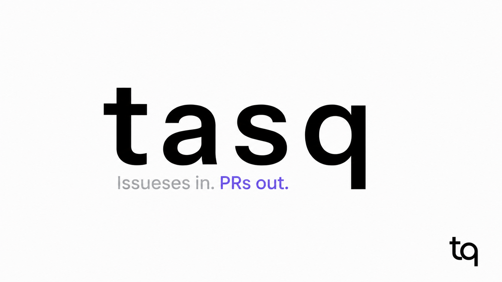
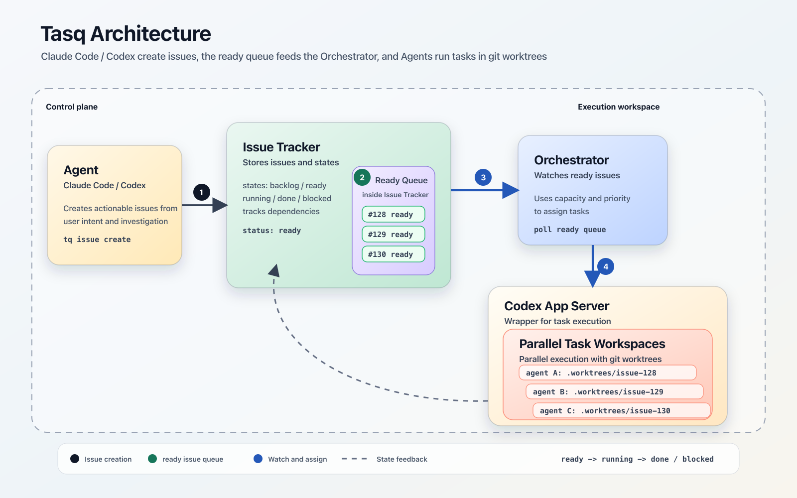

# tasq

AI コーディングエージェント向けタスクマネージャー。

tasq は、実装作業を見えるキューにし、そのキューのためのローカルサービスを起動し、`tq` CLI と Web UI の両方から進捗を確認できるようにするツールです。

[](https://github.com/user-attachments/assets/8c4fdc9c-c70b-4f86-8e0a-323f8880ffb7)

[Tasq の紹介動画を見る](https://github.com/user-attachments/assets/8c4fdc9c-c70b-4f86-8e0a-323f8880ffb7)。

English counterpart: [README.md](README.md).

## Problem

AI コーディングエージェントにより、複数の実装タスクを同時に進められるようになりました。ボトルネックはコードを書くことから、並列作業の管理へ移ります。

### 人間のコンテキスト切り替え

エージェントは並列に実行できますが、人間はどのタスクを割り当てたか、どのエージェントが実行中か、各タスクがどこまで進んでいるか、次に何をレビューすべきかを追跡する必要があります。

### ワークスペースの競合

複数のエージェントを 1 つのリポジトリのチェックアウトで実行すると、ブランチ切り替えの問題、未完了の変更による競合、ファイル編集の重複が発生する可能性があります。

### セットアップ作業の繰り返し

エージェントのタスクごとに、ブランチとワークツリーの作成、依存関係の確認、適切なセットアップコマンドの実行といった同じ準備作業が必要になりがちです。

## Solution

tasq はエージェント作業にプロダクトとしての操作面を与えます。Issue Tracker、ローカルサービス、CLI、Web UI により、タスクの状態とプロジェクトの文脈を 1 か所に集めます。



タスクはレビュー可能なワークフローを進みます。

```text
backlog -> ready -> in_progress -> review -> done
```

## Features

- エージェント向けサイズのタスク、優先度、依存関係、コメントを扱う課題キュー。
- タスク作成、状態更新、進捗コメント追加、ワークフローのスクリプト化に使う `tq` CLI。
- SQLite を使うローカルの issue-tracker、orchestrator、Web UI サービス。
- プロジェクト、課題、コメント、キューの状態、サービスの状態を確認する Web UI。
- 課題を実際のローカルリポジトリのパスに結び付けるプロジェクト登録。
- バイナリのみのローカル構成に必要な実行時バイナリを含むリリースアーカイブ。

## Install

最新の GitHub Release アーカイブをプラットフォームに合わせてダウンロードし、展開した 4 つのバイナリを `PATH` に配置します。

各リリース tarball には次のバイナリが含まれます。

- `tq`: 直接実行する CLI。
- `issue-tracker`: ローカル REST API サービス。
- `orchestrator`: ローカルの実行状態サービス。
- `web`: フロントエンド資産を埋め込んだローカル Web UI サーバー。

最新の正式リリースをインストールします。

```sh
curl -fsSLO https://raw.githubusercontent.com/version-1/tasq/main/scripts/install.sh
less install.sh
sh install.sh
```

実行前に installer の内容を確認してください。Installer は、ダウンロードした release archive を release の `checksums.txt` で検証し、その後 installed `tq` binary が展開元の release binary と一致することを検証します。成功すると `verified installed tq sha256: ...` が表示されます。

インストール先のディレクトリが `PATH` に含まれることを確認します。

```sh
export PATH="${HOME}/.local/bin:${PATH}"
tq version
```

## [Getting Started](https://version-1.github.io/tasq/ja/)

Tasq はマシンローカルの実行時データを `TQ_HOME` 配下に保存します。`TQ_HOME` が未設定の場合は `~/.tasq` を使います。

ローカルデータベースを初期化し、明示的なローカルポートで issue-tracker、orchestrator、Web UI を起動します。

```sh
export TQ_HOME="${HOME}/.tasq"
export TQ_API_URL="http://127.0.0.1:47651"
tq migrate
issue-tracker -addr 127.0.0.1:47651 &
tracker_pid=$!
orchestrator -issue-tracker http://127.0.0.1:47651 -port 47652 &
orchestrator_pid=$!
web -addr 127.0.0.1:47653 \
  -tracker-url http://127.0.0.1:47651 \
  -orchestrator-url http://127.0.0.1:47652 &
web_pid=$!
sleep 1
```

この手順では、ローカルサービスを次のポートで起動します。

| Service | Port |
| --- | ---: |
| issue-tracker | `47651` |
| orchestrator | `47652` |
| web | `47653` |

ローカルリポジトリをプロジェクトとして登録します。

```sh
tq project add --key tasq-demo .
```

タスクを作成し、キューに載せます。

```sh
tq issue create \
  --project tasq-demo \
  --title "Try Tasq from binaries" \
  --description "Create the first issue through the tq CLI."
tq issue list --project tasq-demo
```

Web UI を [http://127.0.0.1:47653](http://127.0.0.1:47653) で開き、プロジェクトと課題が表示されることを確認します。

完了したらローカルサービスを停止します。

```sh
kill "$web_pid" "$orchestrator_pid" "$tracker_pid"
```

これらのポートのいずれかが使用中の場合は、別のループバックポートを選び、`TQ_API_URL`、`-issue-tracker`、`-tracker-url`、`-orchestrator-url` を揃えて変更してください。

## Documentation

- [設計ドキュメント](docs/design.ja.md)
- [リリースバイナリの起動メモ](docs/design/release-binary-startup.ja.md)
- [CLI リファレンス](docs/site/i18n/ja/docusaurus-plugin-content-docs/current/reference/cli-reference.md)

## Development

リポジトリのワークフロー、ローカル開発、検証については [docs/development.ja.md](docs/development.ja.md) を参照してください。
