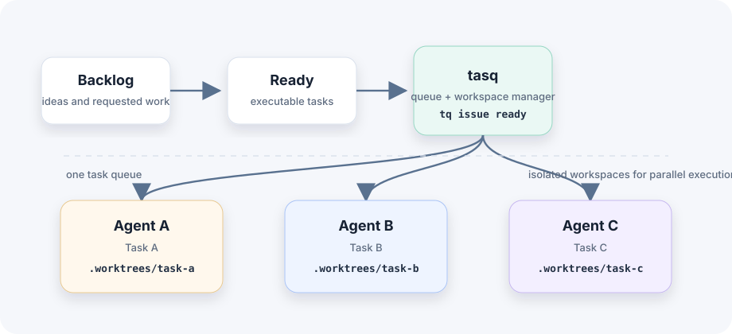

# tasq

AI coding agent task manager.

tasq は、Claude Code、Codex などの AI coding agent で複数の実装タスクを並列実行するための CLI tool です。

タスクごとに独立した workspace を作成し、task registration、agent execution、state management、review、integration までの workflow を支援します。

## Problem

AI coding agents により、複数の実装タスクを同時に進められるようになりました。ボトルネックは code generation そのものから、並列作業の管理へ移ります。

### 人間側の context switching

Agent は並列で実行できますが、人間は各タスクの状態を追い続ける必要があります。

- どのタスクを依頼したか。
- どの agent が実行中か。
- 各タスクがどこまで進んでいるか。
- 次に何を review すべきか。

これにより coordination cost が増え、active work の全体像を安定して把握しにくくなります。

### Workspace conflicts

複数 agent を 1 つの repository checkout で動かすと、競合が起きやすくなります。

- Branch switching が他の作業を中断する。
- 未完了の変更が重なる。
- 複数 agent が同じ workspace から同じ file を編集する。

### 繰り返しの setup work

Agent task ごとに、同じ準備作業が必要になりがちです。

- Branch を作成する。
- Worktree を作成する。
- Dependencies を install または verify する。
- 適切な setup / verification commands を実行する。

この setup をタスクごとに繰り返すと、parallel execution の速度が落ちます。

## Solution

tasq は executable tasks を queue として管理し、ready になったタスクに対して agent-ready な workspace を作成します。



目的は code generation を速くすることだけではありません。parallel agent work によって増える management cost を下げることです。

## Features

### Task queue

実装タスクが workflow を進む状態を追跡します。

```sh
tasq add "implement user login"
```

```text
TODO
READY
RUNNING
DONE
```

### Isolated workspace

タスクごとに Git worktree を作成し、agent が独立して作業できるようにします。

```text
project/
├── main
└── .worktrees/
    ├── task-a
    ├── task-b
    └── task-c
```

### Parallel agent execution

1 つの mutable checkout を共有せず、複数 agent を同時に実行できます。

```text
task-a -> Codex A
task-b -> Codex B
task-c -> Codex C
```

### Review workflow

Agent の成果物をタスク単位で review し、統合できます。

```text
RUNNING
   |
   v
REVIEW
   |
   v
MERGED
```

tasq は AI coding-agent workflow のために、task management、workspace isolation、agent execution support を提供します。

## Components

- Issue Tracker: SQLite backed の Go REST API です。issues、comments、projects、workspaces、UI summaries を所有します。
- Orchestrator: SQLite backed の Go service です。runtime inspection 用に run state と runner events を記録します。
- `tq`: agent と workflow tool が issue-tracker API 経由で issue を作成、取得、一覧表示、更新するための Go CLI です。
- Web UI: issue-tracker API 用の Go-served Vite + React client です。
- TUI: 同じ issue-tracker API を使う Go terminal client です。

Architecture 全体は [docs/design.md](docs/design.md) を参照してください。
Local configuration は [docs/design/configuration.ja.md](docs/design/configuration.ja.md) を参照してください。

## Quick Start

Local development では `make` 経由で Docker Compose を使います。

```sh
make dev-up
```

このコマンドは `dev` container と OpenAPI UI を起動し、`dev` container 内で issue-tracker、orchestrator、Web UI を起動します。Docker Compose が host ports を自動割り当てし、割り当てられた URLs を表示します。

URLs を再表示します。

```sh
make dev-ports
```

環境を停止します。

```sh
make dev-down
```

利用可能な development commands を一覧します。

```sh
make help
```

### Linux/WSL2 Sandbox Prerequisite

Codex は Linux sandboxing に Bubblewrap を使います。Dev image は `bubblewrap` を
install しますが、Codex の sandboxed command を安定して動かすには Linux / WSL2 host
側でも unprivileged user namespace creation が許可されている必要があります。Codex が
`bwrap: No permissions to create a new namespace` を報告する場合は、image に package が
ないだけではなく、host または Docker runtime の capability issue として扱います。

## Verification

標準の Compose-backed checks を実行します。

```sh
make dev-test
```

Go services と Web UI の両方に影響する変更を handoff する前は、broader build check を実行します。

```sh
make dev-build
```

## Documentation

- [docs/development.ja.md](docs/development.ja.md): repository workflow、task flow、documentation update rules、component workflow links。
- [WORKFLOW.md](WORKFLOW.md): orchestrator が使う Symphony runtime workflow contract。
- [docs/design.md](docs/design.md): system architecture と service boundaries。
- [docs/design/deployment.ja.md](docs/design/deployment.ja.md): release tag 作成、GitHub Actions、GoReleaser の deployment flow。
- [docs/references/makefile.ja.md](docs/references/makefile.ja.md): Makefile targets、variables、local development command reference。
- [cmd/issue-tracker/WORKFLOW.md](cmd/issue-tracker/WORKFLOW.md): issue-tracker development workflow。
- [cmd/orchestrator/WORKFLOW.md](cmd/orchestrator/WORKFLOW.md): orchestrator development workflow。
- [cmd/web/WORKFLOW.md](cmd/web/WORKFLOW.md): Web UI development workflow。
- [docs/design/web.md](docs/design/web.md): Web UI structure と styling conventions。
- [docs/openapi/issue-tracker.yml](docs/openapi/issue-tracker.yml): issue-tracker OpenAPI contract。
- [docs/symphony/README.md](docs/symphony/README.md): Symphony documentation index。
- [docs/symphony/SPEC.md](docs/symphony/SPEC.md): Symphony orchestration and runner specification。
- [docs/symphony/DEVIATIONS.md](docs/symphony/DEVIATIONS.md): Symphony specification からの intentional deviations。

English counterpart: [README.md](README.md).

## Notes

- Runtime state と SQLite files は repository の `.tasq/` 配下に作成され、git からは無視されます。
- Compose は Go module/build caches、`cmd/web/frontend/node_modules`、Codex login state、GitHub CLI login state を named Docker volumes に保存します。
- Orchestrator は各 project の `WORKFLOW.md` から Symphony-oriented runtime settings と issue ごとの agent prompt を解決し、fallback として `$TQ_HOME/WORKFLOW.md` を使います。
- Web UI は Go server の proxy paths `/tracker/*` と `/orchestrator/*` 経由で local backends を呼び出します。
- `make run-tq` 経由で実行した `tq` は `$TQ_HOME/system/state.json` から issue-tracker API URL を解決します。
- Codex を device auth で認証し、authentication を `codex-home` Docker volume に永続化するため、初回に `make dev-codex-login` を実行します。
- GitHub CLI を認証し、Git が `gh` を HTTPS credential helper として使うよう設定し、credential を `gh-config` Docker volume に永続化するため、初回に `make dev-gh-login` を実行します。Dev container から push する場合は HTTPS Git remote を使います。
- Codex または GitHub access が必要な agent workflow を実行する前に、`make dev-codex-status` と `make dev-gh-status` で dev container が認証済みであることを確認します。

## tq CLI

issue を一覧表示します。

```sh
make run-tq ARGS="issue list"
```

issue を取得します。

```sh
make run-tq ARGS="issue get 1"
```

issue を作成します。

```sh
make run-tq ARGS='issue create --title "Wire Symphony workflow" --description "Define the first workflow contract" --status ready --priority high'
```

よく使う status / text update には issue shortcut を使えます。

```sh
make run-tq ARGS="issue ready 1"
make run-tq ARGS="issue close 1"
make run-tq ARGS='issue rename 1 "Clarify workflow contract"'
make run-tq ARGS='issue edit 1 "Updated description"'
```

machine-readable output が必要な場合は `--output json` を使います。

```sh
make run-tq ARGS="--output json issue list"
```
