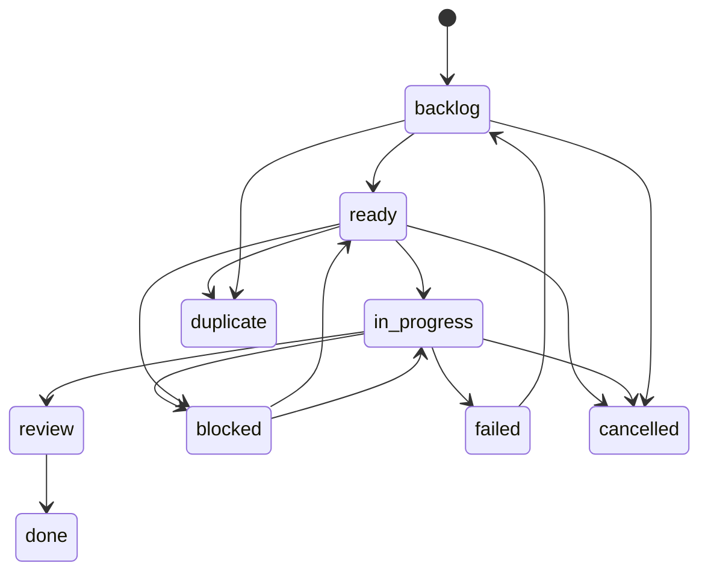

# 課題状態とキュー状態

このドキュメントでは、`issue.status`、システム全体のキューから見た `queueStatus`、想定される課題ワークフローを定義します。フィールド単位のスキーマ詳細は [schema.ja.md](schema.ja.md) を参照してください。API レスポンスの形は [api.ja.md](api.ja.md) を参照してください。

## 所有者

issue-tracker は `issue.status`、依存関係の辺、システム全体のキュー投入可否を所有します。`queueStatus` は、そのキューから見た課題の状態です。データベースには保存せず、`GET /api/v1/summary` は各課題の現在の `queueStatus` を返します。

API は `issue.status` が許可された enum 値のいずれかであることを検証します。一方で、すべての更新に厳密な状態機械を強制するわけではありません。CLI のショートカットや orchestrator のフローは下の標準遷移に従いますが、`PATCH /api/v1/issues/{id}` は任意の有効な status に更新できます。

## `issue.status`

| Status | 意味 | キュー / 依存関係での役割 |
| --- | --- | --- |
| `backlog` | まだ割り当て対象ではない下書きまたは計画中の作業。 | アクティブな依存状態。`queueStatus` は `backlog`。 |
| `ready` | 割り当て候補にできる作業。 | アクティブな依存状態。`queueStatus` は依存関係に応じて `pending` または `queued`。 |
| `in_progress` | すでに着手され、処理中の作業。 | アクティブな依存状態。`queueStatus` は `processing`。 |
| `review` | 人によるレビューまたは最終確認を待っている作業。 | アクティブな依存状態。後続作業はレビュー完了を待つべきです。`queueStatus` は `inactive`。 |
| `blocked` | 外部入力またはブロッカーの解消が必要で、進められない作業。 | 依存先としては後続をブロックする状態。`queueStatus` は `inactive`。 |
| `failed` | 失敗として終了した作業。 | 依存先としては後続をブロックする状態。`queueStatus` は `inactive`。 |
| `cancelled` | 意図的に停止され、続行しない作業。 | 満たされた依存状態。`queueStatus` は `inactive`。 |
| `duplicate` | 別の課題で表現されている重複作業。 | 満たされた依存状態。`queueStatus` は `inactive`。 |
| `done` | 完了した作業。 | 満たされた依存状態。`queueStatus` は `completed`。 |

アクティブな依存状態は `backlog`、`ready`、`in_progress`、`review` です。

満たされた依存状態は `done`、`cancelled`、`duplicate` です。`blocked` と `failed` を含むそれ以外の依存先 status は、依存している `ready` の課題を `pending` に残します。

## `queueStatus`

`queueStatus` は、システム全体のキューから見た課題単位の状態です。`GET /api/v1/summary` は各 `IssueSummary` に現在の値を含めますが、summary がキューモデルを所有しているわけではありません。

| `queueStatus` | 導出条件 |
| --- | --- |
| `backlog` | `issue.status` が `backlog`。 |
| `pending` | `issue.status` が `ready` で、依存先にアクティブな課題が 1 件以上ある。 |
| `queued` | `issue.status` が `ready` で、アクティブな依存先がない。 |
| `processing` | `issue.status` が `in_progress`。 |
| `completed` | `issue.status` が `done`。 |
| `inactive` | `issue.status` がキュー処理の対象外。対象は `review`、`blocked`、`failed`、`cancelled`、`duplicate`。 |

`GET /api/v1/queue` は割り当て用のキュー view で、`ready` の課題だけを `queued` と `pending` の配列に分けて返します。`queueStatus` は同じキューモデルを使い、summary の利用者がキュールールを再実装せずにボード上のすべての課題を表示できるよう分類します。

## 標準遷移

これらは想定されるワークフロー上の遷移です。API が許可する更新の完全な一覧ではありません。

主な CLI ショートカットは、次の status 更新に対応します。

| Command | 結果 |
| --- | --- |
| `tq issue draft <id>` | `issue.status` を `backlog` にします。 |
| `tq issue ready <id>` | `issue.status` を `ready` にします。 |
| `tq issue cancel <id>` | `issue.status` を `cancelled` にします。 |
| `tq issue close <id>` | `issue.status` を `done` にします。 |
| `tq issue update <id> --status <status>` | 任意の有効な `issue.status` にします。 |

## Orchestrator に関する注意

orchestrator は `GET /api/v1/queue` を読み、そのエンドポイントの `queued` 配列に含まれる課題だけを割り当てます。依存関係の解決は issue-tracker 側に残し、orchestrator worker がキュー投入可否のロジックを重複実装しないようにします。

runner や承認の失敗によって人の対応が必要になった場合、orchestrator のフローは実行可能な課題を `blocked` に移し、blocker comment を追加することがあります。ブロッカーが解消されたら、運用者は課題を `ready` に戻せます。
