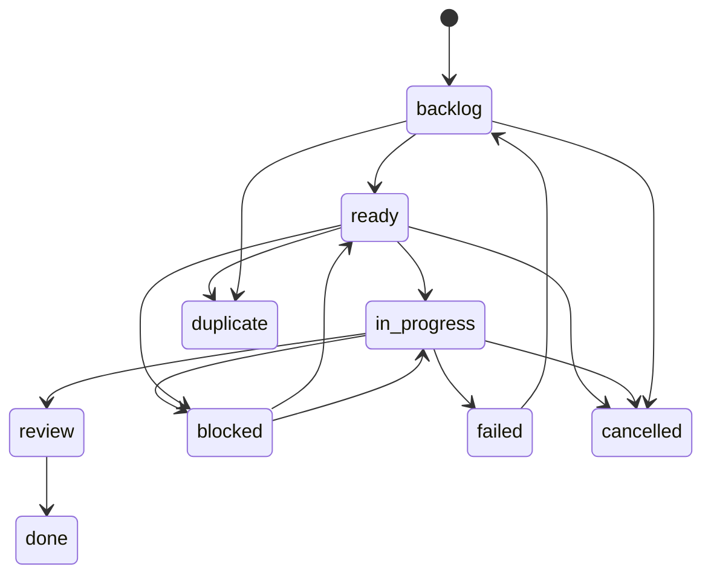

# Issue and Queue Status

This document defines `issue.status`, derived `queueStatus`, and the expected issue workflow. For field-level schema details, see [schema.md](schema.md). For API response shapes, see [api.md](api.md).

## Ownership

The issue-tracker owns `issue.status`, dependency edges, and derived queue eligibility. `queueStatus` is not stored in the database; it is derived for each issue summary in `GET /api/v1/summary`.

The API validates that `issue.status` is one of the allowed enum values. It does not enforce a strict state machine for every update. CLI shortcuts and orchestrator flows follow the standard transitions below, but `PATCH /api/v1/issues/{id}` can set any valid status.

## `issue.status`

| Status | Meaning | Queue/dependency role |
| --- | --- | --- |
| `backlog` | Draft or planned work that is not ready to dispatch. | Active dependency status. Summary `queueStatus` is `backlog`. |
| `ready` | Work is ready to be considered for dispatch. | Active dependency status. Summary `queueStatus` is `pending` or `queued` depending on dependencies. |
| `in_progress` | Work has been picked up and is being processed. | Active dependency status. Summary `queueStatus` is `processing`. |
| `review` | Work is waiting for human review or final validation. | Active dependency status, because downstream work should wait for review to finish. Summary `queueStatus` is `done`. |
| `blocked` | Work cannot proceed without external input or a resolved blocker. | Satisfied dependency status. Summary `queueStatus` is `done`. |
| `failed` | Work ended unsuccessfully. | Satisfied dependency status. Summary `queueStatus` is `done`. |
| `cancelled` | Work was intentionally stopped and should not continue. | Satisfied dependency status. Summary `queueStatus` is `done`. |
| `duplicate` | Work is represented by another issue. | Satisfied dependency status. Summary `queueStatus` is `done`. |
| `done` | Work is complete. | Satisfied dependency status. Summary `queueStatus` is `done`. |

Active dependency statuses are `backlog`, `ready`, `in_progress`, and `review`.

Satisfied dependency statuses are `done`, `cancelled`, `duplicate`, `failed`, and `blocked`.

## `queueStatus`

`queueStatus` is an issue-level derived status returned on `IssueSummary` objects in `GET /api/v1/summary`. It exists for UI and TUI display and should not be used as the persisted source of truth.

| `queueStatus` | Derivation |
| --- | --- |
| `backlog` | `issue.status` is `backlog`. |
| `pending` | `issue.status` is `ready` and at least one dependency is still active. |
| `queued` | `issue.status` is `ready` and no dependency is active. |
| `processing` | `issue.status` is `in_progress`. |
| `done` | `issue.status` is outside the queue flow: `review`, `done`, `blocked`, `failed`, `cancelled`, or `duplicate`. |

`GET /api/v1/queue` keeps its narrower meaning: it only returns `ready` issues split into `queued` and `pending` arrays. In contrast, summary `queueStatus` covers every issue in the board.

## Standard Transitions

These transitions describe the expected workflow. They are not the complete set of API-permitted updates.

Common CLI shortcuts map to these status updates:

| Command | Result |
| --- | --- |
| `tq issue draft <id>` | Sets `issue.status` to `backlog`. |
| `tq issue ready <id>` | Sets `issue.status` to `ready`. |
| `tq issue cancel <id>` | Sets `issue.status` to `cancelled`. |
| `tq issue close <id>` | Sets `issue.status` to `done`. |
| `tq issue update <id> --status <status>` | Sets any valid `issue.status`. |

## Orchestrator Notes

The orchestrator reads `GET /api/v1/queue` and dispatches only issues in the endpoint's `queued` array. Dependency resolution remains in the issue-tracker so orchestrator workers do not duplicate queue eligibility logic.

When runner or approval failures require human action, orchestrator flows may move a runnable issue to `blocked` and add a blocker comment. Operators can move the issue back to `ready` when the blocker is resolved.
