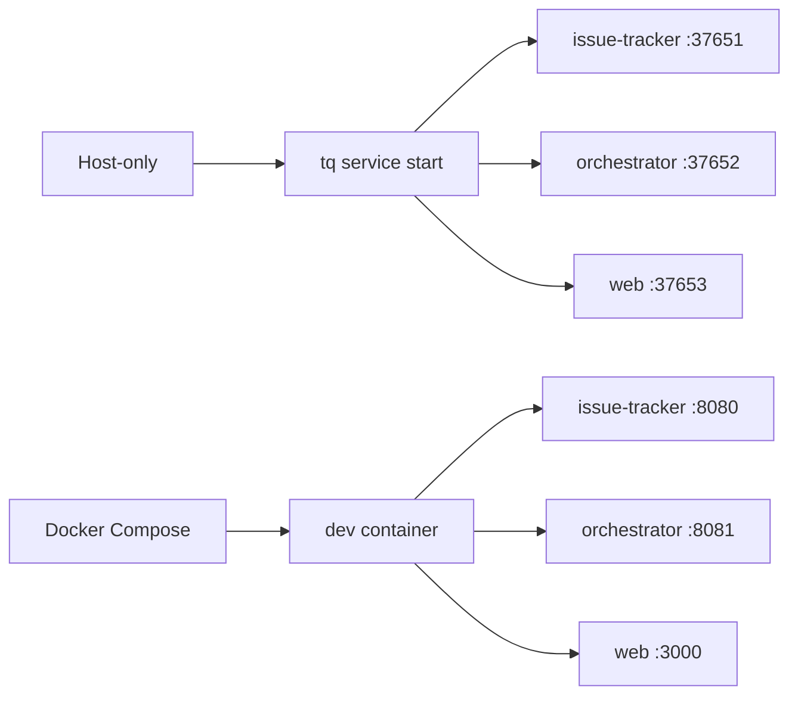

# Running Locally

Use local services when you need to exercise the full issue-tracker,
orchestrator, and Web flow. The fastest project-level path is Compose; the
host-only path is useful when testing release binaries or a locally built `tq`.

## Service Modes



## Host Commands

Build and start host services:

```sh
make build-tq
export PATH="$PWD/bin:$PATH"
export TQ_HOME="$PWD/.tasq"
tq migrate
tq service start
tq service status
```

Inspect logs:

```sh
tq logs issue-tracker -n 200
tq logs orchestrator -n 200
tq logs web -n 200
```

Stop services when the local session is done.

```sh
tq service stop
```

## Compose Commands

```sh
make dev-up
make dev-ports
make run-ps
make run-logs
```

In Compose, `make dev-up` starts all core services. Use individual `run-*`
targets when restarting one process after code changes:

```sh
make run-issue-tracker
make run-orchestrator
make run-web
```

`make run-web` starts the Go Web server with backend URLs pointing at the
issue-tracker and orchestrator inside the dev container.

## Local Smoke Flow

After services are running, use a small issue flow to confirm the tracker, Web
UI, and status transitions are wired together.

```sh
tq project add --key tasq .
tq issue create \
  --project tasq \
  --title "Local smoke test" \
  --description "Confirm local services are reachable."
tq issue list --project tasq
tq issue ready 1
tq web
```

In Compose, run the same commands through the dev container:

```sh
make run-tq ARGS='project add --key tasq .'
make run-tq ARGS='issue list --project tasq'
```

Use `make dev-open` to open the Web UI and OpenAPI UI from the assigned
Compose ports.

## Resetting Local State

Runtime state and SQLite files are stored under `.tasq/` for repository-local
development. To reset Compose-managed local databases:

```sh
make dev-reset-db CONFIRM=1
```

For host-only mode, stop services before deleting files under
`.tasq/system/data/`.
