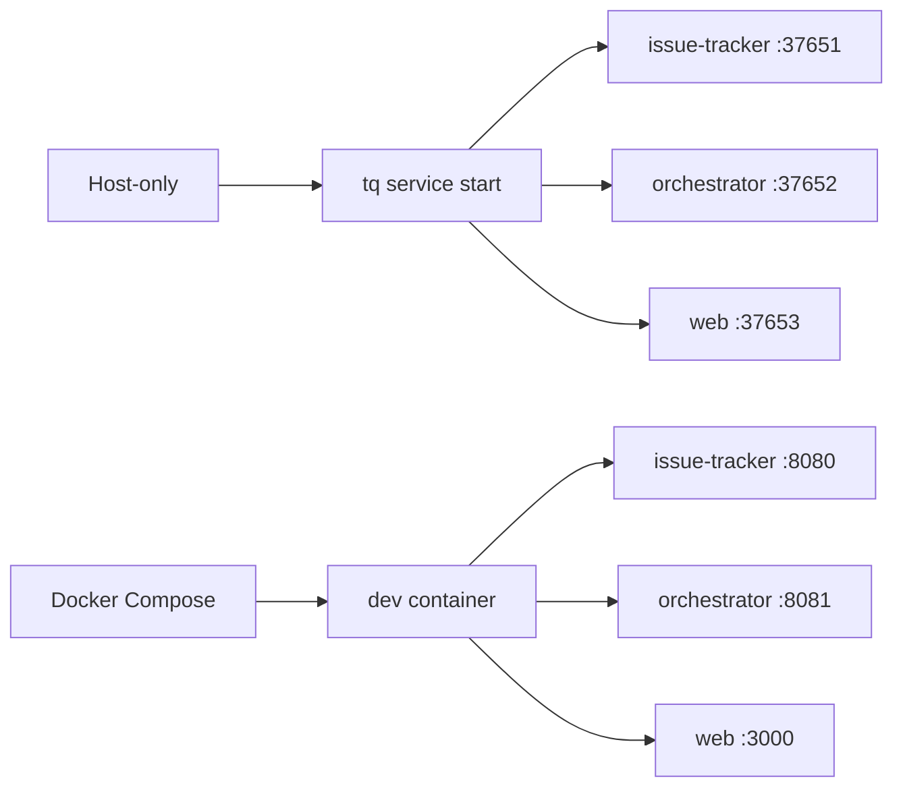

# Running Locally

Use local services when you need to exercise the full issue-tracker, orchestrator, and Web flow.

## Service Modes



## Host Commands

```sh
tq migrate
tq service start
tq service status
tq logs issue-tracker -n 200
tq logs orchestrator -n 200
tq logs web -n 200
```

Stop services when the local session is done.

```sh
tq service stop
```

## Compose Commands

```sh
make dev-up
make dev-ports
```

In Compose, `make run-web` starts the Go Web server with backend URLs pointing at the issue-tracker and orchestrator inside the dev container.
