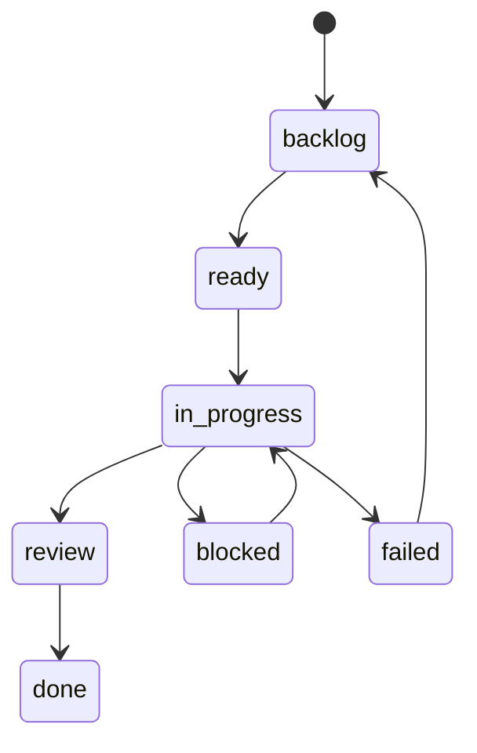

# Issue Tracker

The issue-tracker is the user-facing source of truth for Tasq work.

It stores projects, issues, comments, attachment metadata, and summary data in SQLite. It also serves the API used by `tq`, the Web UI, and other clients.

## Responsibilities

- Store and validate issue data.
- Require each issue to belong to one project.
- Store comments and image attachment metadata.
- Store attachment bytes under `$TQ_HOME/system/data/attachments`.
- Serve project, issue, comment, attachment, workflow, and summary endpoints.
- Prevent project deletion while linked issues exist.

## Issue Workflow

## Data Shape

Each issue has a project, title, description, status, priority, optional assignee, timestamps, comments, and optional image attachments. Markdown descriptions and comments can reference uploaded images with `attachment://<id>` URLs.

The issue-tracker API returns JSON success responses as `{ "data": ..., "meta": {} }` and error responses as `{ "error": { "code": "...", "message": "..." }, "meta": {} }`.
