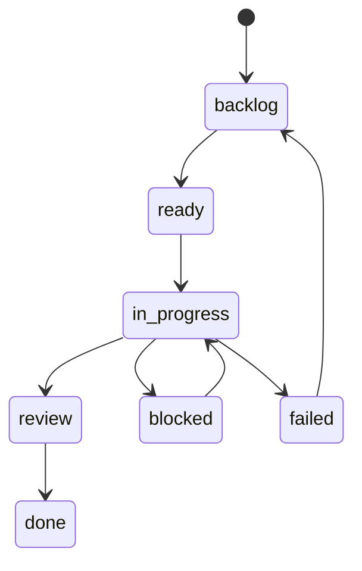

# Issue Tracker

The issue-tracker is the user-facing source of truth for Tasq work.

It stores projects, issues, issue artifacts, comments, attachment metadata, and summary data in
SQLite. It also serves the API used by `tq`, the Web UI, agents, and other
clients.

## Responsibilities

- Store and validate project, issue, comment, and attachment data as the single source of truth for Tasq work.
- Serve the project, issue, comment, attachment, workflow, and summary API used by `tq`, the Web UI, and agents.
- Associate issues with external artifacts such as pull-request URLs.

See [Architecture: issue-tracker](https://github.com/version-1/tasq/blob/main/docs/design/architecture.md#issue-tracker) for the full responsibility list and ownership boundaries.

## Issue Workflow

## Data Shape

Each issue has a project, title, description, status, priority, optional assignee, timestamps, comments, optional image attachments, and an `artifacts` array. The initial artifact is one `pull_request` URL per issue. Markdown descriptions and comments can reference uploaded images with `attachment://<id>` URLs.

The issue-tracker API returns JSON success responses as `{ "data": ..., "meta": {} }` and error responses as `{ "error": { "code": "...", "message": "..." }, "meta": {} }`.
