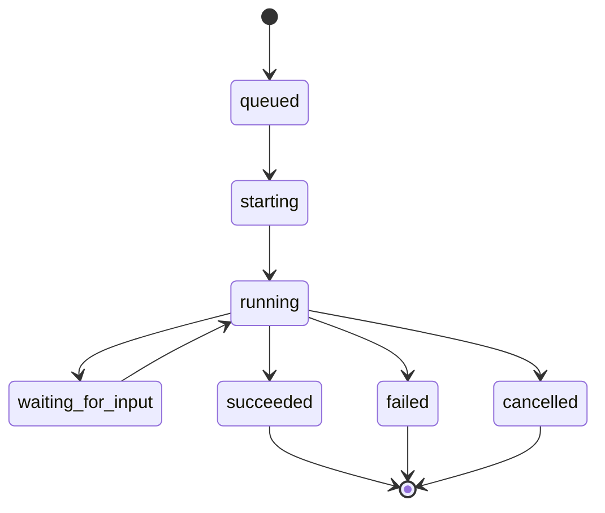

# Orchestrator

The orchestrator records agent run history and runtime inspection data. It is
the boundary for workspaces, runner events, and Codex app-server-backed
execution.

## Responsibilities

- Create run records in its own SQLite database.
- Load repository workflow configuration used for orchestration.
- Create sanitized per-issue workspaces under the configured workspace root.
- Record runner events and workspace metadata.
- Keep enough run metadata to reconnect a blocked Codex session to the issue
  that started it.
- Expose optional loopback HTTP APIs for runtime state and run details.

## What It Does Not Own

The orchestrator does not own issue title, description, status, priority, assignee, comments, or attachments. Those fields belong to the issue-tracker.

The orchestrator also does not decide the user-facing workflow state. A run can fail while an issue stays `in_progress`, or a human can move an issue to `blocked` without changing a run record.

## Codex Symphony Alignment

Tasq's orchestration model follows the direction of
[Codex Symphony](https://github.com/openai/symphony) for workspace,
workflow, agent-runner, tracker, and observability behavior. Tasq keeps a local
copy of that specification in
[docs/symphony/SPEC.md](https://github.com/version-1/tasq/blob/main/docs/symphony/SPEC.md)
and records intentional Tasq differences in
[docs/symphony/DEVIATIONS.md](https://github.com/version-1/tasq/blob/main/docs/symphony/DEVIATIONS.md).

The main difference for these concepts is ownership: Tasq already has a local
issue-tracker that owns issue state and dependency edges, while the orchestrator
uses the issue-tracker queue view to dispatch agent work.

## Run Lifecycle

## Workspace Role

Workspaces give agents isolated execution directories. The orchestrator stores
enough workspace metadata to debug setup failures, recover paths, and connect a
run back to the issue that caused it. For Codex runs, that connection includes
the thread information surfaced through the Web UI activity view when available.
