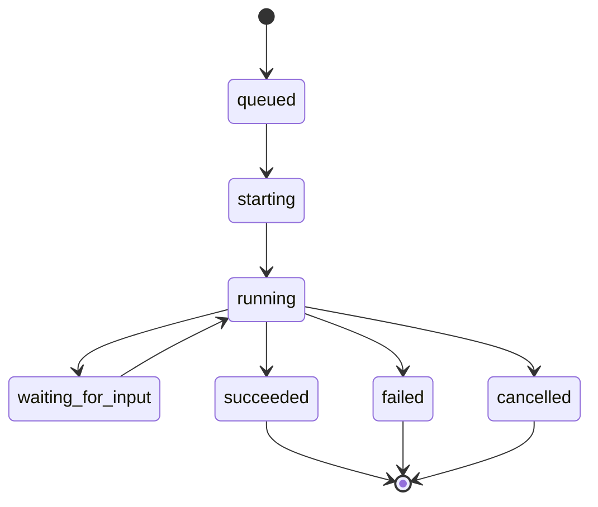

# Orchestrator

The orchestrator records agent run history and runtime inspection data. It is the boundary for workspaces, runner events, and future Codex app-server execution.

## Responsibilities

- Create run records in its own SQLite database.
- Load repository workflow configuration used for orchestration.
- Create sanitized per-issue workspaces under the configured workspace root.
- Record runner events and workspace metadata.
- Expose optional loopback HTTP APIs for runtime state and run details.

## What It Does Not Own

The orchestrator does not own issue title, description, status, priority, assignee, comments, or attachments. Those fields belong to the issue-tracker.

The orchestrator also does not decide the user-facing workflow state. A run can fail while an issue stays `in_progress`, or a human can move an issue to `blocked` without changing a run record.

## Run Lifecycle

## Workspace Role

Workspaces give agents isolated execution directories. The orchestrator stores enough workspace metadata to debug setup failures, recover paths, and connect a run back to the issue that caused it.
