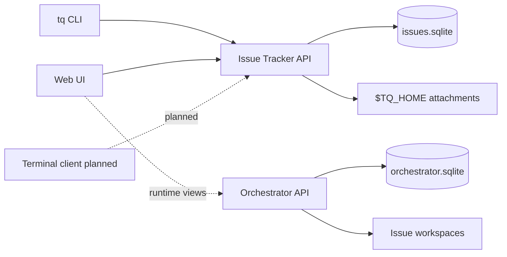

# Concepts Overview

Tasq separates issue state from run state. The issue-tracker owns what users and agents are working on. The orchestrator owns how agent runs, workspaces, and runtime events are recorded.

## Ownership Model

The issue-tracker is the user-facing source of truth for projects, issues, comments, attachments, and board summaries. Clients such as `tq` and the Web UI read and mutate that state through the issue-tracker API. A terminal client is planned but is not part of the published user guide yet.

The orchestrator is the runtime source of truth for runs, runner events, and workspace metadata. It does not directly change issue status. When a task status changes, the change still goes through the issue-tracker.

## Client Flow

## Status Boundaries

Issue status and run status are intentionally different concepts.

| Area | Owner | Examples |
| --- | --- | --- |
| Issue workflow | Issue Tracker | `backlog`, `ready`, `in_progress`, `review`, `done` |
| Run lifecycle | Orchestrator | `queued`, `running`, `waiting_for_input`, `succeeded`, `failed` |
| Workspace metadata | Orchestrator | workspace path, setup result, source path |
| Attachments | Issue Tracker | image metadata and bytes under `TQ_HOME` |

This split keeps the user workflow stable even as orchestration internals evolve.
