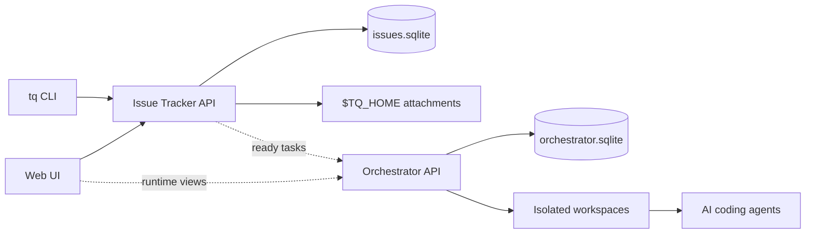

# Concepts Overview

Tasq separates task state, agent execution state, and workspace metadata so
multiple AI coding-agent tasks can run in parallel without sharing one mutable
checkout.

The issue-tracker owns what users and agents are working on. The orchestrator
owns how agent runs, workspaces, and runtime events are recorded. The `tq` CLI
and Web UI sit on top of those services so both humans and agents can use the
same local source of truth.

## Ownership Model

The issue-tracker is the user-facing source of truth for projects, issues,
comments, attachments, and board summaries. Clients such as `tq`, agent CLI
guides, and the Web UI read and mutate that state through the issue-tracker
API.

The orchestrator is the runtime source of truth for runs, runner events, and
workspace metadata. It prepares isolated workspaces for executable tasks and
records enough runtime state to inspect what happened. It does not directly
change issue status. When a task status changes, the change still goes through
the issue-tracker.

## Task Dependencies

Tasq supports dependencies between tasks. A task can declare other tasks that
must be completed first, which lets users and agents describe a larger piece of
work as smaller, ordered steps instead of one long instruction.

The issue-tracker stores those dependencies and keeps the dependency graph
valid. Tasks whose dependencies are not complete stay out of the agent queue;
once their prerequisites are done, they become eligible for agent execution.

## Client Flow

## Status Boundaries

Issue status and run status are intentionally different concepts.

| Area | Owner | Examples |
| --- | --- | --- |
| Issue workflow | Issue Tracker | `backlog`, `ready`, `in_progress`, `blocked`, `failed`, `review`, `done` |
| Run lifecycle | Orchestrator | `queued`, `running`, `waiting_for_input`, `succeeded`, `failed` |
| Workspace metadata | Orchestrator | workspace path, setup result, source path |
| Attachments | Issue Tracker | image metadata and bytes under `TQ_HOME` |

This split keeps the user workflow stable even as orchestration internals evolve.
It also lets a blocked Codex session be recovered from the run metadata exposed
in the Web UI without changing the issue workflow state.
