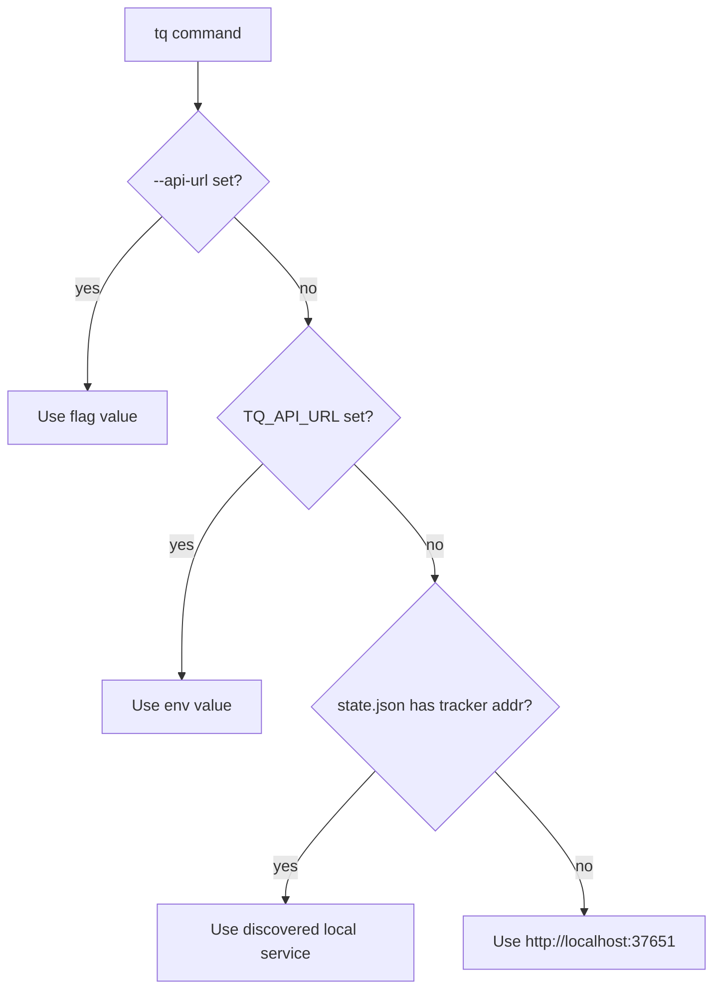

# tq CLI

`tq` is the command-line interface for agents, scripts, and developers who need
a stable local interface to Tasq.

It wraps issue-tracker APIs, local service management, project registration,
workflow configuration, migrations, logs, and Web UI launch behavior. In
day-to-day Tasq usage, `tq` is often driven by agents such as Codex or Claude
Code, so keeping it installed on `PATH` and exposing the `tasq-cli` guide helps
agents choose the right command without guessing.

## Design Goals

- Keep common issue operations scriptable, with human-readable output by default and `--output json` for tools and agents.
- Give agents one stable command surface for issue lookup, artifacts, comments, and status
  transitions.
- Avoid direct orchestration mutations from issue commands.

See [Architecture: tq](https://github.com/version-1/tasq/blob/main/docs/design/architecture.md#tq) for the full responsibility list, including API URL resolution order and service management.

## API URL Resolution

## Common Surfaces

`tq issue`, `tq artifact`, and `tq comment` operate on issue-tracker data. `tq project`
registers repositories and validates workflow setup. `tq workflow` manages
project workflow overrides. `tq service`, `tq logs`, and `tq migrate` operate
on local runtime state. `tq web` opens the local Web UI after the services are
running.
