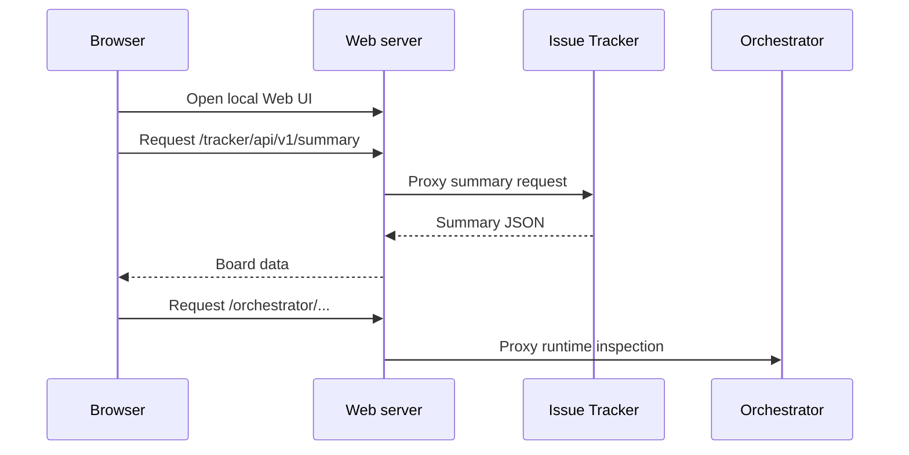

# Web

The Web UI is a Go-served Vite and React application for viewing and updating
Tasq issues in a browser.

It is designed as a local operations surface rather than a hosted multi-tenant
product. The server runs on the local loopback Web port during service startup
and proxies API calls to the local backends.

## Responsibilities

- Render and update Tasq issue summaries in the browser through the issue-tracker API.
- Show a pull-request link on an issue card and details sidebar when the issue has that artifact.
- Show issue activity so operators can find run context such as a Codex thread
  ID when a blocked session needs to be resumed.

See [Architecture: web-ui](https://github.com/version-1/tasq/blob/main/docs/design/architecture.md#web-ui) for the full responsibility list, including SPA routing and the tracker/orchestrator proxy paths.

## Request Path

## Conceptual Boundary

The Web UI does not own persistence. It presents and mutates issue state through
the issue-tracker API, and it can inspect orchestrator runtime state through the
Web server proxy when those views are available. Activity and run links are
navigation aids; the issue-tracker and orchestrator remain the authoritative
stores.

Artifact links are display-only. They open in a safe new tab, and the UI omits them entirely when an issue has no pull-request artifact.
