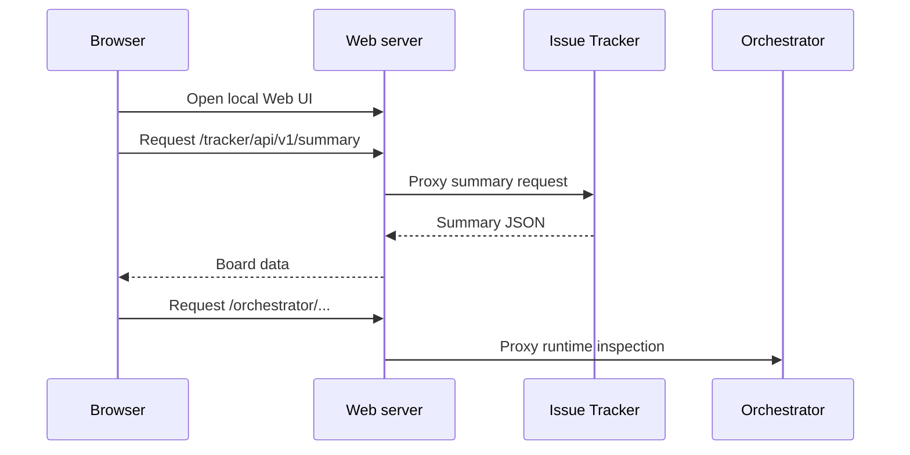

# Web

The Web UI is a Go-served Vite and React application for viewing and updating Tasq issues in a browser.

It is designed as a local operations surface rather than a hosted multi-tenant product. The server runs on a loopback port during local service startup and proxies API calls to the local backends.

## Responsibilities

- Render project and issue summaries.
- Display status, priority, assignee, descriptions, comments, and run links where available.
- Move issues between statuses through the issue-tracker API.
- Serve browser routes through SPA fallback.
- Proxy `/tracker/*` to the issue-tracker and `/orchestrator/*` to the orchestrator.

## Request Path

## Conceptual Boundary

The Web UI does not own persistence. It presents and mutates issue state through the issue-tracker API, and it can inspect orchestrator runtime state through the Web server proxy when those views are available.
