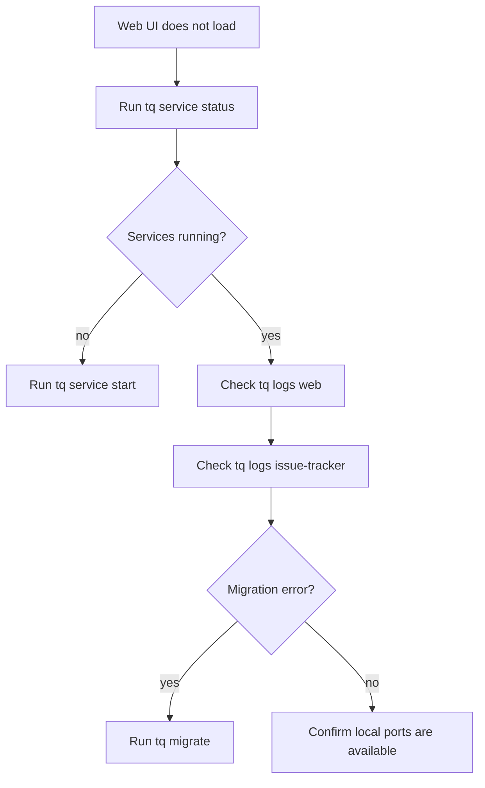

# Web UI Operations

The Web UI is the browser surface for local issue operations. It is most useful when scanning several issues, changing status, or reviewing descriptions and comments with Markdown rendering.

## Start Local Services

```sh
tq migrate
tq service start
tq service status
```

Open the Web UI after services are running.

```sh
tq web
```

## Runtime Ports

Host-only service mode uses fixed local ports:

| Service | Port |
| --- | ---: |
| issue-tracker | `37651` |
| orchestrator | `37652` |
| web | `37653` |

Discovery metadata is written to `$TQ_HOME/system/state.json`, and logs are written under `$TQ_HOME/system/log/`.

## Troubleshooting



If the Web UI loads but issue data is missing, verify that the project is registered and that `tq issue list --project <key>` returns the expected issues.
