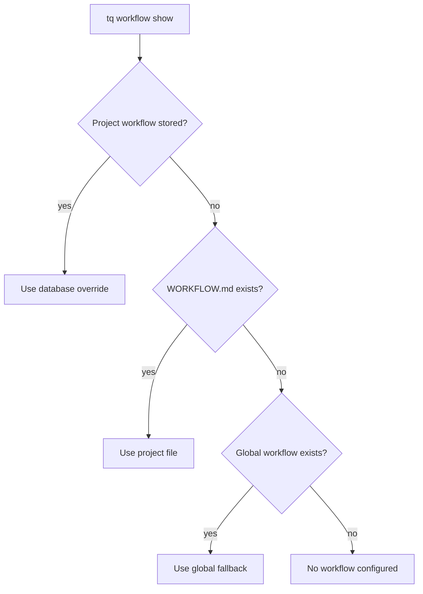

# Workflow Configuration

Tasq uses workflow documents to describe how agents should work in a project. A workflow can come from a project-local file, a stored project override, or a global fallback.

## Resolution Order



## Project Workflow Files

Keep `WORKFLOW.md` in the repository when the workflow should move with the codebase. This is the easiest model for local development because review rules, verification commands, and task flow are versioned alongside the project.

## Stored Overrides

Use a stored override when a project needs machine-local workflow changes without modifying the repository.

```sh
tq workflow add --project tasq --file WORKFLOW.md
tq workflow show --project tasq
tq workflow remove --project tasq
```

Removing the stored workflow returns the project to file-based resolution.

## Practical Guidance

Keep workflow documents operational. They should define branch policy, required verification, issue synchronization, and handoff expectations. Avoid putting long design explanations in workflow files; link to documentation instead.
