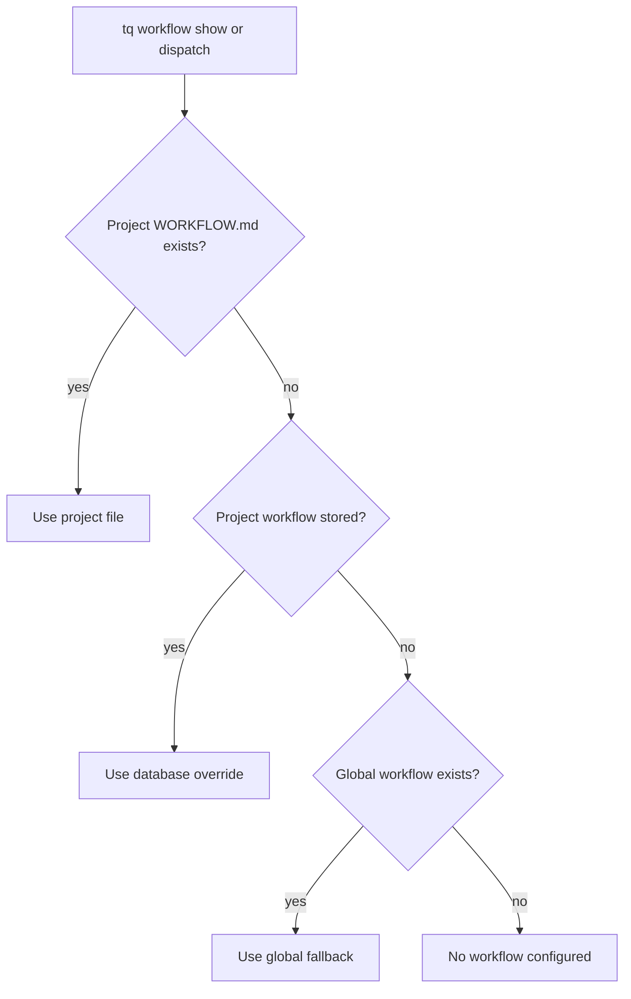

# Workflow Configuration

Tasq uses workflow documents to describe how agents should work in a project. A workflow can come from a project-local file, a stored project override, or a global fallback.

## Resolution Order



The first available source wins. Both `tq workflow show` and the orchestrator use this order when
resolving a project's effective workflow.

## Project Workflow Files

Keep `WORKFLOW.md` in the repository when the workflow should move with the codebase. This is the easiest model for local development because review rules, verification commands, and task flow are versioned alongside the project.

## Front Matter and Prompt Template

`WORKFLOW.md` can start with YAML front matter, followed by an agent-facing Markdown prompt
template. Front matter is machine-readable orchestration configuration; use the prompt template
for instructions an agent should read and follow.

The supported fields, validation rules, hook behavior, and prompt-template variables are defined
in the canonical [Tasq Symphony Workflow Contract](https://github.com/version-1/tasq/blob/main/docs/symphony/WORKFLOW_CONTRACT.md).

## When Workflows Are Loaded

Tasq resolves the effective workflow per project when the orchestrator evaluates
queued work and prepares an agent run. That means updates to a project
`WORKFLOW.md` or stored override affect later dispatches, not an agent run that
is already running.

Run `tq project check <key>` after editing `WORKFLOW.md` to validate the project setup before
moving issues to `ready`.

## Stored Overrides

Use a stored override when a project has no local `WORKFLOW.md` and needs a machine-local workflow
without modifying the repository. A local `WORKFLOW.md` always takes precedence, so a stored
workflow cannot override a file that remains in the project.

```sh
tq workflow add --project tasq --file machine-local-workflow.md
tq workflow show --project tasq
tq workflow remove --project tasq
```

Removing the stored workflow makes the next available source in the resolution order effective.

## Practical Guidance

Keep workflow documents operational. They should define branch policy, required verification, issue synchronization, and handoff expectations. Avoid putting long design explanations in workflow files; link to documentation instead.
