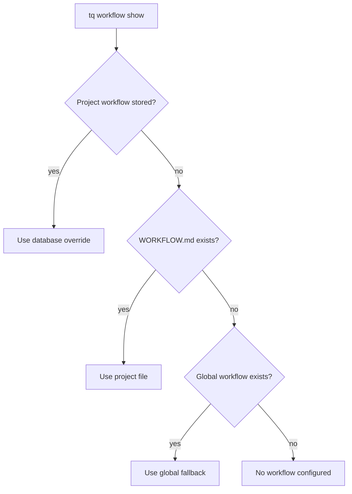

# Workflow Configuration

Tasq uses workflow documents to describe how agents should work in a project. A workflow can come from a project-local file, a stored project override, or a global fallback.

## Resolution Order



## Project Workflow Files

Keep `WORKFLOW.md` in the repository when the workflow should move with the codebase. This is the easiest model for local development because review rules, verification commands, and task flow are versioned alongside the project.

## Front Matter

`WORKFLOW.md` can start with YAML front matter. Tasq treats front matter as
machine-readable orchestration configuration and treats the Markdown body as the
agent-facing task workflow or prompt template.

Use front matter for values the orchestrator must parse before starting work,
such as polling, workspace, agent, Codex, server, hook, and tracker settings.
Use the Markdown body for instructions an agent should read and follow.

Example:

```md
---
polling:
  interval_ms: 30000
workspace:
  root: .worktrees/agents
agent:
  max_concurrent_agents: 5
  max_turns: 20
codex:
  command: codex --sandbox workspace-write app-server
  read_timeout_ms: 15000
  turn_timeout_ms: 3600000
---

# Task

Issue ID: {{ issue.id }}
Title: {{ issue.title }}

## Required Flow

1. Confirm the issue scope before editing.
2. Make focused changes in the isolated workspace.
3. Run verification and leave a handoff comment.
```

When a workflow is stored through `tq workflow add`, Tasq stores the parsed
front matter separately from the Markdown body. Unknown front matter fields are
ignored for forward compatibility, but invalid values for supported fields
cause workflow validation to fail.

## When Workflows Are Loaded

Tasq resolves the effective workflow per project when the orchestrator evaluates
queued work and prepares an agent run. That means updates to a project
`WORKFLOW.md` or stored override affect later dispatches, not an agent run that
is already running.

Run `tq project check <key>` after editing `WORKFLOW.md` to validate the
front matter and project setup before moving issues to `ready`.

## Stored Overrides

Use a stored override when a project needs machine-local workflow changes without modifying the repository.

```sh
tq workflow add --project tasq --file WORKFLOW.md
tq workflow show --project tasq
tq workflow remove --project tasq
```

Removing the stored workflow returns the project to file-based resolution.

## Practical Guidance

Keep workflow documents operational. They should define branch policy, required verification, issue synchronization, and handoff expectations. Avoid putting long design explanations in workflow files; link to documentation instead.
