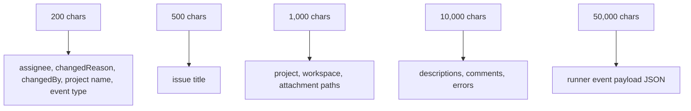

# Schema

Tasq validates entity data at the store layer on create and update operations. This reference summarizes the public field constraints that clients should respect.

## Issue Tracker Entities

| Entity | Required fields | Key constraints |
| --- | --- | --- |
| Issue | `projectId`, `title` | title 1-500 chars, description max 10,000 chars, changedReason max 200 chars, assignee max 200 chars, immutable project ownership |
| IssueStatusEvent | generated by status updates | records fromStatus, toStatus, optional changedReason, actor, optional commentId |
| Comment | `issueId`, `author`, `body` | body 1-10,000 chars, type defaults to `general` |
| Attachment | `entityType`, `entityId`, `file` | image PNG/JPEG/GIF/WebP, max 5 MiB |
| Project | `key`, `name`, `location` | key format, name 1-200 chars, description max 10,000 chars, absolute location |
| ProjectWorkflow | `projectId`, `frontmatter`, `body`, `checksum` | one workflow override per project, checksum is SHA256 hex |

## Orchestrator Entities

| Entity | Required fields | Key constraints |
| --- | --- | --- |
| Run | `issueId`, `attempt`, `orchestratorId` | run ID generated, status defaults to `queued` |
| RunnerEvent | `runId`, `occurredAt` | payload JSON must be valid when present |
| WorkspaceMetadata | `workspaceKey`, `issueId`, `path` | workspace key max 200 chars, paths must be absolute |
| WorkspaceSetupFailure | `issueId`, `error` | records setup failure context |

## Enums

| Field | Values |
| --- | --- |
| Issue status | `backlog`, `ready`, `in_progress`, `review`, `done`, `blocked`, `failed`, `cancelled`, `duplicate` |
| Queue status | `backlog`, `pending`, `queued`, `processing`, `completed`, `inactive` |
| Issue priority | `low`, `normal`, `high`, `urgent` |
| Comment type | `progress`, `blocker`, `handoff`, `general` |
| Attachment entity type | `issue`, `comment` |
| Run status | `queued`, `running`, `succeeded`, `failed`, `cancelled` |

## String and Path Limits

Absolute path fields must start with `/`. Clients such as `tq project add` check local directory existence when they can access the target filesystem.
