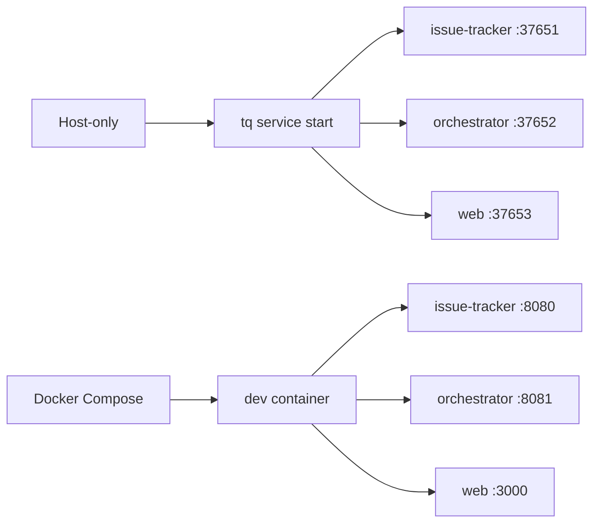

# ローカル実行

full issue-tracker、orchestrator、Web flow を exercise する必要がある場合は、local service を使います。

## Service mode



## Host command

```sh
tq migrate
tq service start
tq service status
tq logs issue-tracker -n 200
tq logs orchestrator -n 200
tq logs web -n 200
```

local session が終わったら service を停止します。

```sh
tq service stop
```

## Compose command

```sh
make dev-up
make dev-ports
```

Compose では、`make run-web` が Go Web server を起動し、backend URL は dev container 内の issue-tracker と orchestrator を指します。
