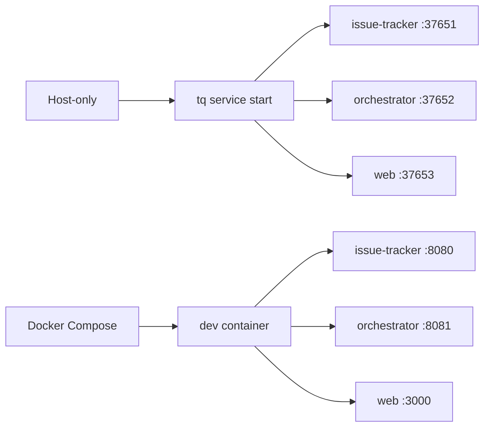

# Running Locally

full issue-tracker、orchestrator、Web flow を試す必要がある場合は local services を
使います。project-level では Compose が最短経路です。release binaries や locally
built `tq` を試す場合は host-only path が便利です。

## Service Modes



## Host Commands

host services を build して起動します。

```sh
make build-tq
export PATH="$PWD/bin:$PATH"
export TQ_HOME="$PWD/.tasq"
tq migrate
tq service start
tq service status
```

logs を確認します。

```sh
tq logs issue-tracker -n 200
tq logs orchestrator -n 200
tq logs web -n 200
```

local session が終わったら services を停止します。

```sh
tq service stop
```

## Compose Commands

```sh
make dev-up
make dev-ports
make run-ps
make run-logs
```

Compose では、`make dev-up` が core services をすべて起動します。code changes のあと
特定の process だけを再起動する場合は、個別の `run-*` targets を使います。

```sh
make run-issue-tracker
make run-orchestrator
make run-web
```

`make run-web` は Go Web server を起動し、backend URLs は dev container 内の
issue-tracker と orchestrator を指します。

## Local Smoke Flow

services が動いたら、小さな issue flow で tracker、Web UI、status transitions が
つながっていることを確認します。

```sh
tq project add --key tasq .
tq issue create \
  --project tasq \
  --title "Local smoke test" \
  --description "Confirm local services are reachable."
tq issue list --project tasq
tq issue ready 1
tq web
```

Compose では同じ操作を dev container 経由で実行します。

```sh
make run-tq ARGS='project add --key tasq .'
make run-tq ARGS='issue list --project tasq'
```

assigned Compose ports から Web UI と OpenAPI UI を開くには `make dev-open` を使います。

## Local State を reset する

repository-local development では runtime state と SQLite files は `.tasq/` 配下に
保存されます。Compose-managed local databases を reset するには次を使います。

```sh
make dev-reset-db CONFIRM=1
```

host-only mode では、`.tasq/system/data/` 配下の files を削除する前に services を
停止してください。
