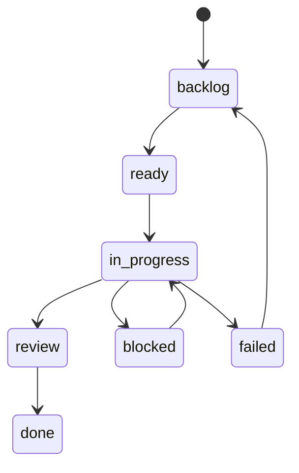

# Issue Tracker

issue-tracker は Tasq work の user-facing source of truth です。

プロジェクト、課題、課題 Artifact、コメント、添付ファイルのメタデータ、サマリーデータを SQLite に保存します。
また、`tq`、Web UI、agents、その他の clients が使う API を提供します。

## 責務

- issue data を保存して validate する。
- 各 issue が 1 つの project に属することを要求する。
- comments と image attachment metadata を保存する。
- プルリクエスト URL など、課題に関連付ける外部 Artifact を保存する。
- attachment bytes を `$TQ_HOME/system/data/attachments` 配下に保存する。
- project、issue、comment、attachment、workflow、summary endpoints を提供する。
- linked issues が存在する間は project deletion を防ぐ。

## Issue Workflow

## データ構造

各課題はプロジェクト、タイトル、説明、ステータス、優先度、任意の担当者、時刻、コメント、任意の画像添付、`artifacts` 配列を持ちます。初期の Artifact は、各課題に 1 件だけ関連付けられる `pull_request` URL です。Markdown の説明とコメントでは、`attachment://<id>` URL を使ってアップロード済み画像を参照できます。

issue-tracker API は JSON success responses を `{ "data": ..., "meta": {} }` として、
error responses を `{ "error": { "code": "...", "message": "..." }, "meta": {} }` として
返します。
