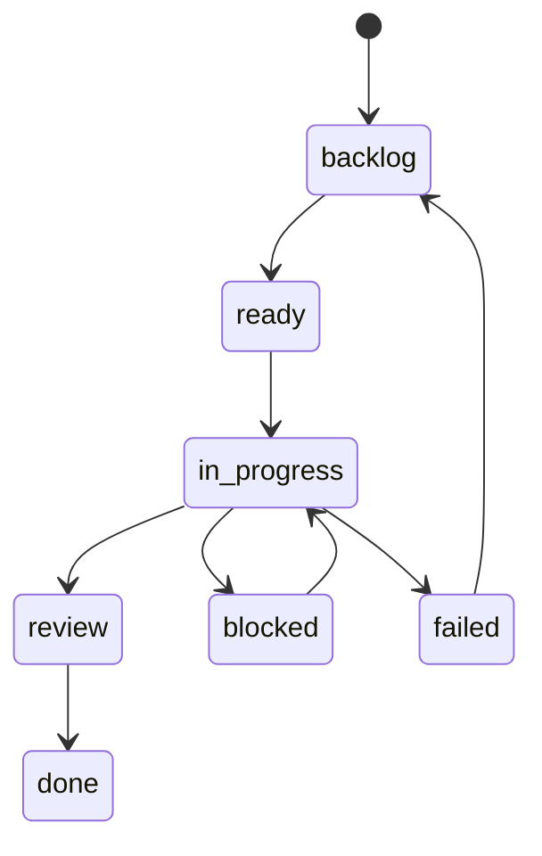

# Issue Tracker

issue-tracker は Tasq work の user-facing source of truth です。

SQLite に project、issue、comment、attachment metadata、summary data を保存します。また、`tq`、Web UI、その他の client が使う API を提供します。

## 責務

- issue data を保存し、validate する。
- 各 issue が 1 つの project に属することを要求する。
- comment と image attachment metadata を保存する。
- attachment bytes を `$TQ_HOME/system/data/attachments` 配下に保存する。
- project、issue、comment、attachment、workflow、summary endpoint を提供する。
- linked issue が存在する間は project deletion を防ぐ。

## Issue workflow

## データ構造

各 issue は project、title、description、status、priority、optional assignee、timestamp、comment、optional image attachment を持ちます。Markdown description と comment は uploaded image を `attachment://<id>` URL で参照できます。

issue-tracker API は JSON success response を `{ "data": ..., "meta": {} }` として、error response を `{ "error": { "code": "...", "message": "..." }, "meta": {} }` として返します。
