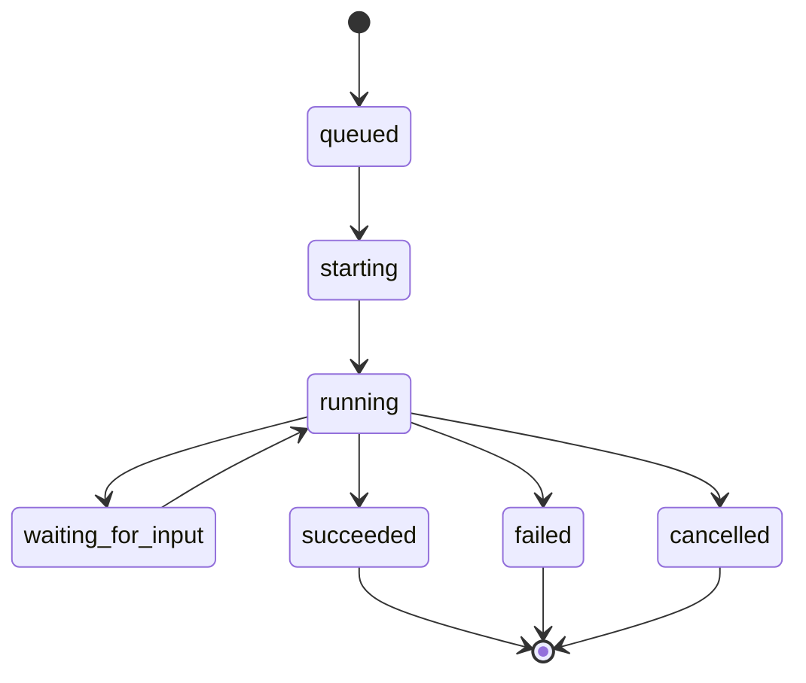

# Orchestrator

orchestrator は agent run history と runtime inspection data を記録します。workspace、runner event、将来の Codex app-server execution の boundary です。

## 責務

- 独自の SQLite database に run record を作成する。
- orchestration で使う repository workflow configuration を読み込む。
- configured workspace root 配下に sanitized per-issue workspace を作成する。
- runner event と workspace metadata を記録する。
- runtime state と run detail のための optional loopback HTTP API を公開する。

## 所有しないもの

orchestrator は issue title、description、status、priority、assignee、comment、attachment を所有しません。これらの field は issue-tracker に属します。

orchestrator は user-facing workflow state も決定しません。run が fail しても issue は `in_progress` のままにできますし、人間が run record を変更せずに issue を `blocked` に移動することもできます。

## Run lifecycle

## Workspace の役割

Workspace は agent に isolated execution directory を提供します。orchestrator は setup failure を debug し、path を recover し、run をその原因になった issue に接続するために十分な workspace metadata を保存します。
