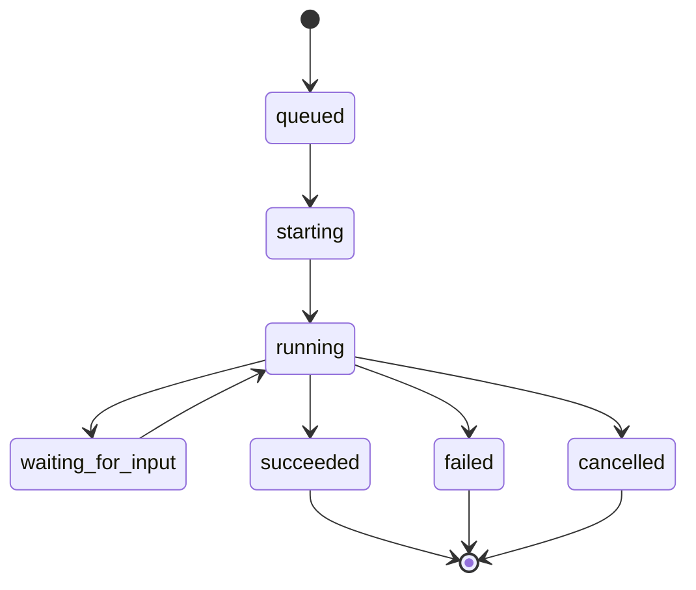

# Orchestrator

orchestrator は agent run history と runtime inspection data を記録します。workspaces、runner events、将来の Codex app-server execution の boundary です。

## 責務

- 自身の SQLite database に run records を作成する。
- orchestration に使う repository workflow configuration を読み込む。
- configured workspace root 配下に sanitized per-issue workspaces を作成する。
- runner events と workspace metadata を記録する。
- runtime state と run details のための optional loopback HTTP APIs を公開する。

## 所有しないもの

orchestrator は issue title、description、status、priority、assignee、comments、attachments を所有しません。これらの fields は issue-tracker に属します。

orchestrator は user-facing workflow state も決定しません。run が failed になっても issue は `in_progress` のままにできますし、人間が run record を変更せずに issue を `blocked` へ移動することもできます。

## Run Lifecycle

## Workspace の役割

Workspaces は agents に isolated execution directories を提供します。orchestrator は setup failures の debug、paths の recovery、run とその原因になった issue の接続に十分な workspace metadata を保存します。
