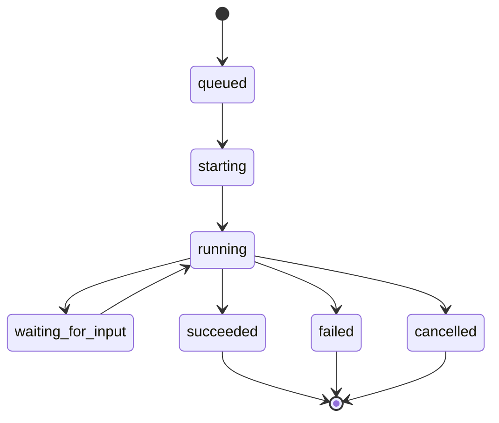

# Orchestrator

orchestrator は agent run history と runtime inspection data を記録します。workspaces、
runner events、Codex app-server-backed execution の boundary です。

## 責務

- 自身の SQLite database に run records を作成する。
- orchestration に使う repository workflow configuration を読み込む。
- configured workspace root 配下に sanitized per-issue workspaces を作成する。
- runner events と workspace metadata を記録する。
- blocked になった Codex セッションを、開始元の issue に接続し直すために十分な
  run metadata を保持する。
- runtime state と run details のための optional loopback HTTP APIs を公開する。

## 所有しないもの

orchestrator は issue title、description、status、priority、assignee、comments、
attachments を所有しません。これらの fields は issue-tracker に属します。

orchestrator は user-facing workflow state も決定しません。run が failed になっても issue は `in_progress` のままにできますし、人間が run record を変更せずに issue を `blocked` へ移動することもできます。

## Codex Symphony との関係

Tasq の orchestration model は、workspace、workflow、agent-runner、tracker、observability
の方向性として [Codex Symphony](https://github.com/openai/symphony) に従います。Tasq は
その仕様のローカルコピーを
[docs/symphony/SPEC.md](https://github.com/version-1/tasq/blob/main/docs/symphony/SPEC.md)
に保持し、Tasq 固有の差分を
[docs/symphony/DEVIATIONS.md](https://github.com/version-1/tasq/blob/main/docs/symphony/DEVIATIONS.md)
に記録しています。

この Concepts で重要な違いは ownership です。Tasq には issue state と dependency
edges を所有する local issue-tracker があり、orchestrator は issue-tracker の queue
view を使って agent work を dispatch します。

## Run Lifecycle

## Workspace の役割

Workspaces は agents に isolated execution directories を提供します。orchestrator は
setup failures の debug、paths の recovery、run とその原因になった issue の接続に
十分な workspace metadata を保存します。Codex runs では、利用可能な場合に Web UI の
activity view から確認できる thread 情報もこの接続に含まれます。
