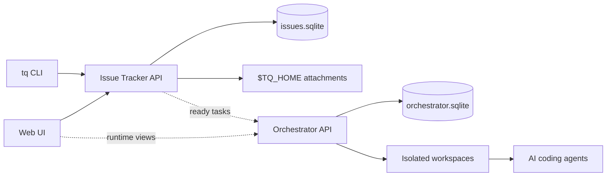

# 概念の概要

Tasq は task state、agent execution state、workspace metadata を分離し、複数の AI coding-agent tasks を 1 つの mutable checkout に共有させず並列実行できるようにします。

issue-tracker は users と agents が取り組んでいるものを所有します。orchestrator は agent runs、workspaces、runtime events の記録方法を所有します。

## 所有モデル

issue-tracker は projects、issues、comments、attachments、board summaries の user-facing source of truth です。`tq` や Web UI などの clients は issue-tracker API を通じてその state を読み書きします。

orchestrator は runs、runner events、workspace metadata の runtime source of truth です。実行可能な task のために isolated workspace を準備し、何が起きたかを inspect できる runtime state を記録します。issue status を直接変更しません。task status が変わる場合でも、その変更は issue-tracker を通ります。

## クライアントの流れ

## 状態の境界

Issue status と run status は意図的に異なる概念です。

| Area | Owner | Examples |
| --- | --- | --- |
| Issue workflow | Issue Tracker | `backlog`, `ready`, `in_progress`, `review`, `done` |
| Run lifecycle | Orchestrator | `queued`, `running`, `waiting_for_input`, `succeeded`, `failed` |
| Workspace metadata | Orchestrator | workspace path, setup result, source path |
| Attachments | Issue Tracker | `TQ_HOME` 配下の image metadata と bytes |

この分離により、orchestration internals が進化しても user workflow は安定したままになります。
