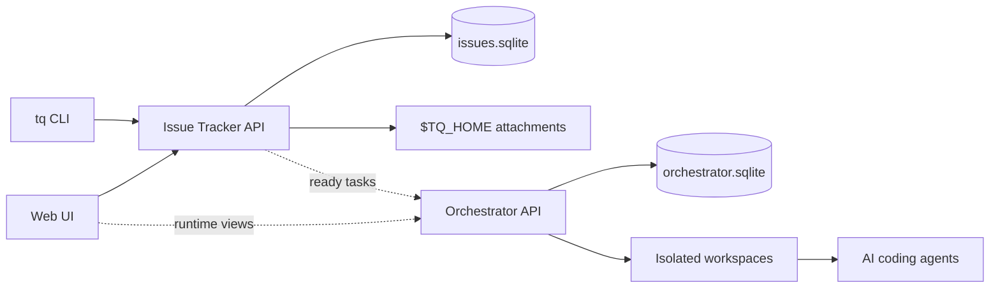

# 概念の概要

Tasq はタスク状態、エージェント実行状態、ワークスペース metadata を分離し、
複数の AI コーディングエージェントのタスクを、1 つの mutable checkout を共有させずに
並列実行できるようにします。

issue-tracker はユーザーとエージェントが取り組んでいる対象を所有します。orchestrator
は agent runs、workspaces、runtime events の記録方法を所有します。`tq` CLI と Web UI
はこれらのサービスの上にあり、人間とエージェントが同じローカルの source of truth を
使えるようにします。

## 所有モデル

issue-tracker は projects、issues、comments、attachments、board summaries の
user-facing source of truth です。`tq`、エージェント向け CLI guide、Web UI などの
clients は issue-tracker API を通じてその状態を読み書きします。

orchestrator は runs、runner events、workspace metadata の runtime source of truth です。
実行可能なタスクのために isolated workspace を準備し、何が起きたかを確認できる
runtime state を記録します。issue status を直接変更しません。task status が変わる
場合でも、その変更は issue-tracker を通ります。

## タスクの依存関係

Tasq はタスク間の依存関係を表現できます。あるタスクの前に完了しておくべきタスクを
指定できるため、大きな作業を 1 つの長い指示ではなく、順序のある小さなステップとして
扱えます。

issue-tracker はその依存関係を保存し、依存関係のグラフが正しい状態に保たれるように
します。依存先が完了していないタスクはエージェントのキューに入りません。前提タスクが
完了すると、そのタスクはエージェントが実行できる対象になります。

## クライアントの流れ

## 状態の境界

Issue status と run status は意図的に異なる概念です。

| 領域 | Owner | Examples |
| --- | --- | --- |
| Issue workflow | Issue Tracker | `backlog`, `ready`, `in_progress`, `blocked`, `failed`, `review`, `done` |
| Run lifecycle | Orchestrator | `queued`, `running`, `waiting_for_input`, `succeeded`, `failed` |
| Workspace metadata | Orchestrator | workspace path, setup result, source path |
| Attachments | Issue Tracker | `TQ_HOME` 配下の image metadata と bytes |

この分離により、orchestration internals が進化しても user workflow は安定したままに
なります。また、issue workflow state を変えずに、Web UI に表示される run metadata
から blocked になった Codex セッションを復旧できます。
