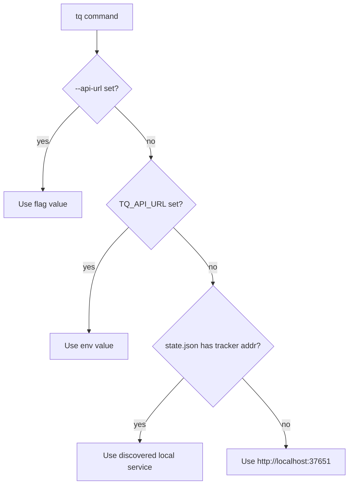

# tq CLI

`tq` は、Tasq に対して stable local interface を必要とする agent、script、developer のための command-line interface です。

issue-tracker API、local service management、project registration、workflow configuration、migration、log、Web UI launch behavior を wrap します。

## 設計目標

- common issue operation を scriptable に保つ。
- default では human-readable output を返す。
- tool と agent のために `--output json` を support する。
- すべての command に API URL を渡さなくても local service URL を resolve できるようにする。
- issue command から direct orchestration mutation を避ける。

## API URL の解決

## 主な操作面

`tq issue` と `tq comment` は issue-tracker data を操作します。`tq project` は repository を登録し、workflow setup を validate します。`tq workflow` は project workflow override を管理します。`tq service`、`tq logs`、`tq migrate` は local runtime state を操作します。
