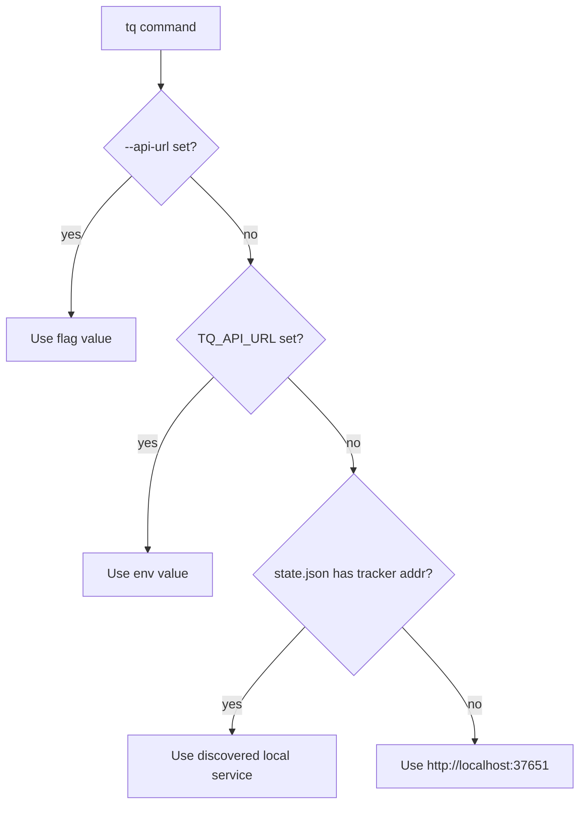

# tq CLI

`tq` は、Tasq への安定した local interface を必要とする agents、scripts、developers
のための command-line interface です。

issue-tracker APIs、local service management、project registration、workflow
configuration、migrations、logs、Web UI launch behavior を wrap します。日常的な
Tasq 利用では、`tq` は Codex や Claude Code などのエージェントから実行される場面が
多いコマンドです。そのため、`tq` を `PATH` に置き、`tasq-cli` guide を参照できる
ようにすると、エージェントが適切な command を推測せずに選びやすくなります。

## 設計目標

- common issue operations を scriptable に保つ。
- default では human-readable output を返す。
- tools と agents 向けに `--output json` を support する。
- すべての command に API URL を渡さなくても local service URLs を解決する。
- 課題の検索、Artifact、コメント、ステータス遷移のために、エージェントへ 1 つの安定した
  command surface を提供する。
- issue commands から direct orchestration mutations を避ける。

## API URL の解決

## 主な操作面

`tq issue`、`tq artifact`、`tq comment` は Issue Tracker のデータに対して動作します。`tq project` は
repositories を登録し、workflow setup を validate します。`tq workflow` は project
workflow overrides を管理します。`tq service`、`tq logs`、`tq migrate` は local
runtime state に対して動作します。`tq web` は services が起動している状態で local
Web UI を開きます。
