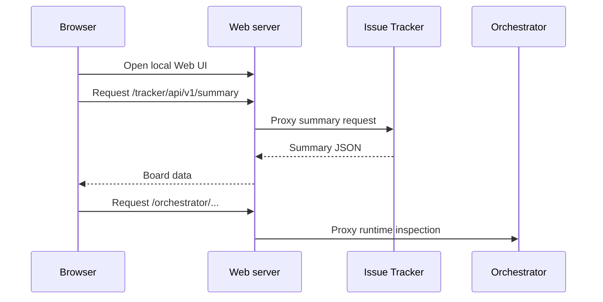

# Web

Web UI は、browser で Tasq issues を表示・更新するための Go-served Vite and React
application です。

hosted multi-tenant product ではなく、local operations surface として設計されています。
server は service startup 中に local loopback Web port で動作し、API calls を local
backends に proxy します。

## 責務

- project と issue summaries を render する。
- status、priority、assignee、descriptions、comments、利用可能な run links を表示する。
- 課題に該当 Artifact がある場合、課題カードと詳細サイドバーにプルリクエストへのリンクを表示する。
- blocked になったセッションを resume するときに Codex thread ID などの run context を
  確認できるよう、issue activity を表示する。
- issue-tracker API を通じて issues を statuses 間で移動する。
- SPA fallback で browser routes を提供する。
- `/tracker/*` を issue-tracker に、`/orchestrator/*` を orchestrator に proxy する。

## リクエスト経路

## 概念上の境界

Web UI は persistence を所有しません。issue-tracker API を通じて issue state を提示・
変更し、該当 views が利用可能な場合は Web server proxy を通じて orchestrator
runtime state を inspect できます。Activity と run links は navigation aids であり、
issue-tracker と orchestrator が引き続き authoritative stores です。

Artifact リンクは表示専用です。安全な新しいタブで開き、プルリクエスト Artifact がない課題ではリンク自体を表示しません。
