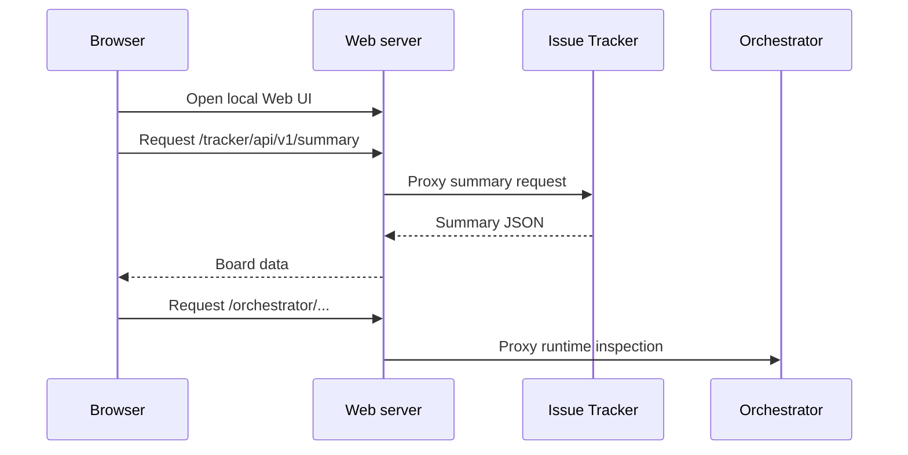

# Web

Web UI は、browser で Tasq issue を表示・更新するための Go-served Vite and React application です。

hosted multi-tenant product ではなく、local operations surface として設計されています。server は local service startup 中に loopback port で動作し、API call を local backend に proxy します。

## 責務

- project と issue summary を描画する。
- status、priority、assignee、description、comment、利用可能な run link を表示する。
- issue-tracker API を通じて issue を status 間で移動する。
- SPA fallback で browser route を提供する。
- `/tracker/*` を issue-tracker に、`/orchestrator/*` を orchestrator に proxy する。

## リクエスト経路

## 概念上の境界

Web UI は persistence を所有しません。issue-tracker API を通じて issue state を表示・変更し、該当 view が利用可能な場合は Web server proxy を通じて orchestrator runtime state を inspect できます。
