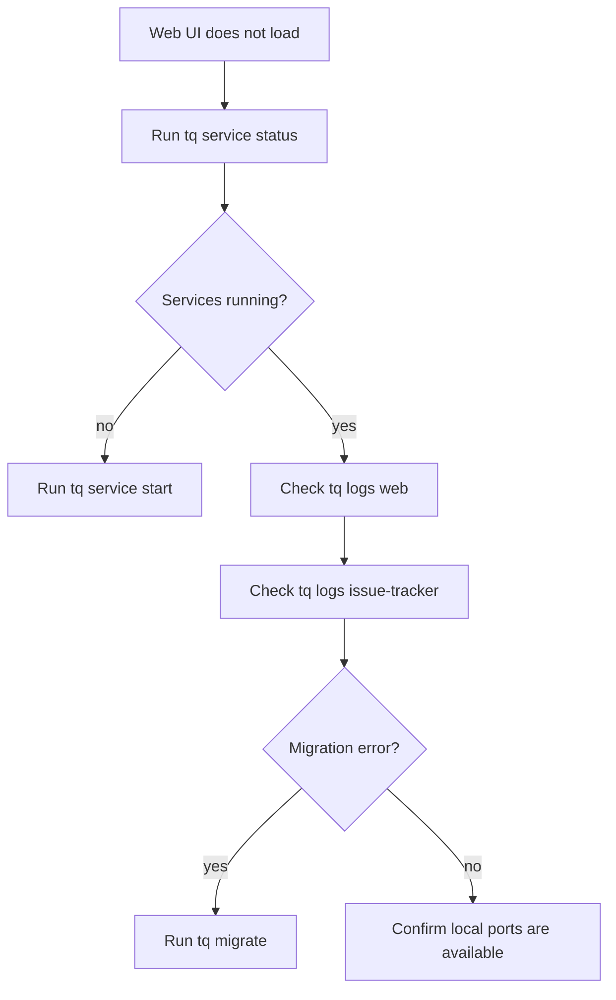

# Web UI Operations

Web UI は local issue operations の browser surface です。複数 issues の scan、status 変更、Markdown rendering 付きの descriptions と comments の review に特に有用です。

## Local Services を起動する

```sh
tq migrate
tq service start
tq service status
```

services が動作してから Web UI を開きます。

```sh
tq web
```

## Runtime Ports

host-only service mode は fixed local ports を使います。

| Service | Port |
| --- | ---: |
| issue-tracker | `37651` |
| orchestrator | `37652` |
| web | `37653` |

Discovery metadata は `$TQ_HOME/system/state.json` に書き込まれ、logs は `$TQ_HOME/system/log/` 配下に書き込まれます。

## Troubleshooting



Web UI は読み込めるが issue data が missing の場合は、project が登録済みであることと、`tq issue list --project <key>` が期待する issues を返すことを確認してください。
