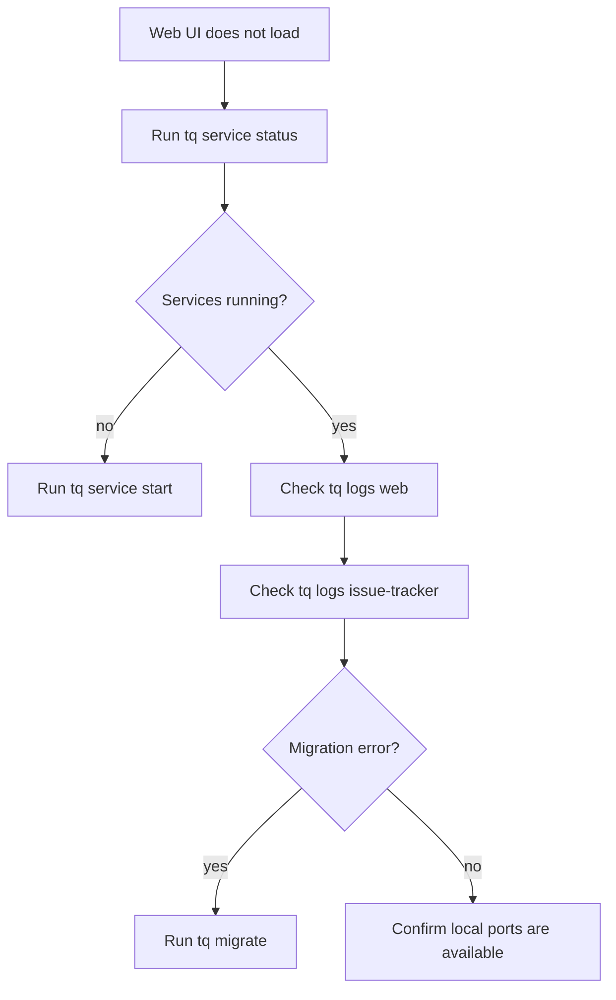

# Web UI Operations

Web UI は local issue operation のための browser surface です。複数の issue を scan する、status を変更する、Markdown rendering 付きで description や comment を review する場合に特に有用です。

## Local service を起動する

```sh
tq migrate
tq service start
tq service status
```

service が起動したら Web UI を開きます。

```sh
tq web
```

## Runtime port

Host-only service mode は固定 local port を使います。

| Service | Port |
| --- | ---: |
| issue-tracker | `37651` |
| orchestrator | `37652` |
| web | `37653` |

Discovery metadata は `$TQ_HOME/system/state.json` に書き込まれ、log は `$TQ_HOME/system/log/` 配下に書き込まれます。

## Troubleshooting



Web UI は読み込めるが issue data が表示されない場合は、project が登録済みであることと、`tq issue list --project <key>` が期待する issue を返すことを確認してください。
