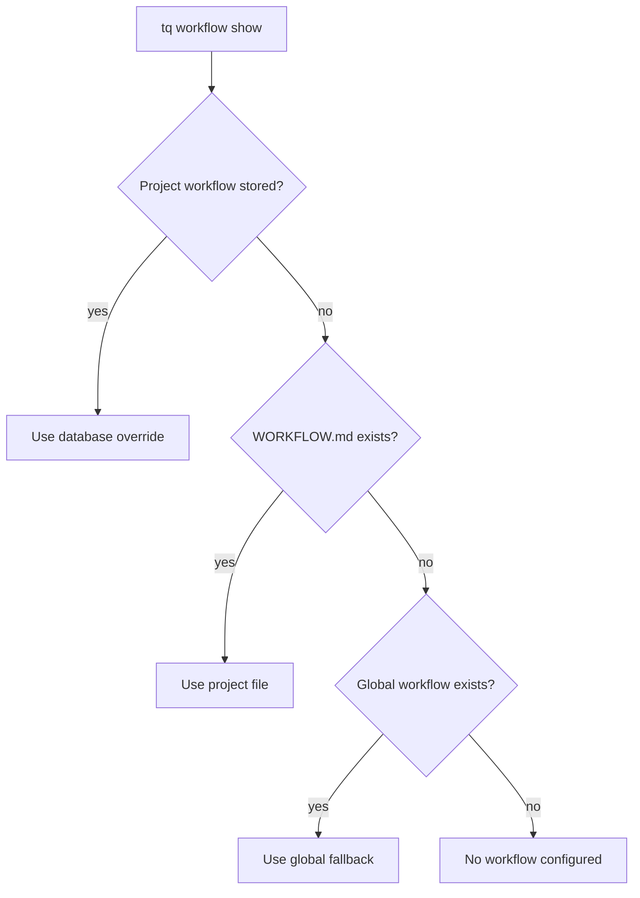

# Workflow Configuration

Tasq は workflow documents を使って、agents が project でどう作業すべきかを説明します。workflow は project-local file、stored project override、または global fallback から取得できます。

## 解決順序



## Project Workflow Files

workflow を codebase と一緒に動かしたい場合は、repository に `WORKFLOW.md` を置いてください。review rules、verification commands、task flow が project と一緒に versioned されるため、local development ではこれが最も簡単な model です。

## Stored Overrides

repository を変更せずに project が machine-local workflow changes を必要とする場合は、stored override を使います。

```sh
tq workflow add --project tasq --file WORKFLOW.md
tq workflow show --project tasq
tq workflow remove --project tasq
```

stored workflow を削除すると、project は file-based resolution に戻ります。

## 実践的な指針

workflow documents は operational に保ってください。branch policy、required verification、issue synchronization、handoff expectations を定義するべきです。workflow files に長い design explanations を置くことは避け、代わりに documentation へ link してください。
