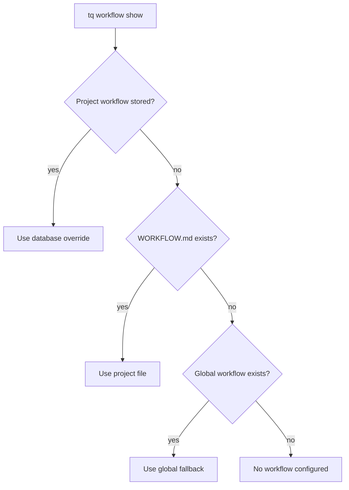

# Workflow Configuration

Tasq は workflow documents を使って、agents が project でどう作業すべきかを説明します。workflow は project-local file、stored project override、または global fallback から取得できます。

## 解決順序



## Project Workflow Files

workflow を codebase と一緒に動かしたい場合は、repository に `WORKFLOW.md` を置いてください。review rules、verification commands、task flow が project と一緒に versioned されるため、local development ではこれが最も簡単な model です。

## Front Matter

`WORKFLOW.md` の先頭には YAML front matter を置けます。Tasq は front matter を
machine-readable な orchestration configuration として扱い、Markdown body を
エージェントが読む task workflow または prompt template として扱います。

polling、workspace、agent、Codex、server、hook、tracker settings のように、
orchestrator が作業開始前に parse する必要がある値は front matter に置きます。
エージェントが読んで従う手順は Markdown body に書きます。

例:

```md
---
polling:
  interval_ms: 30000
workspace:
  root: .worktrees/agents
agent:
  max_concurrent_agents: 5
  max_turns: 20
codex:
  command: codex --sandbox workspace-write app-server
  read_timeout_ms: 15000
  turn_timeout_ms: 3600000
---

# Task

Issue ID: {{ issue.id }}
Title: {{ issue.title }}

## Required Flow

1. Confirm the issue scope before editing.
2. Make focused changes in the isolated workspace.
3. Run verification and leave a handoff comment.
```

`tq workflow add` で workflow を保存すると、Tasq は parse した front matter と
Markdown body を分けて保存します。未知の front matter fields は forward compatibility
のために無視されますが、サポートされている fields の値が不正な場合は workflow
validation が失敗します。

## Workflow が読み込まれるタイミング

Tasq は、orchestrator が queued work を評価し、エージェント実行を準備するときに、
project ごとの effective workflow を解決します。そのため、project の `WORKFLOW.md`
や stored override の変更は、そのあとに dispatch される作業に反映されます。すでに
running の agent run には反映されません。

`WORKFLOW.md` を編集したら、issue を `ready` に移動する前に `tq project check <key>`
を実行し、front matter と project setup を validate してください。

## Stored Overrides

repository を変更せずに project が machine-local workflow changes を必要とする場合は、stored override を使います。

```sh
tq workflow add --project tasq --file WORKFLOW.md
tq workflow show --project tasq
tq workflow remove --project tasq
```

stored workflow を削除すると、project は file-based resolution に戻ります。

## 実践的な指針

workflow documents は operational に保ってください。branch policy、required verification、issue synchronization、handoff expectations を定義するべきです。workflow files に長い design explanations を置くことは避け、代わりに documentation へ link してください。
