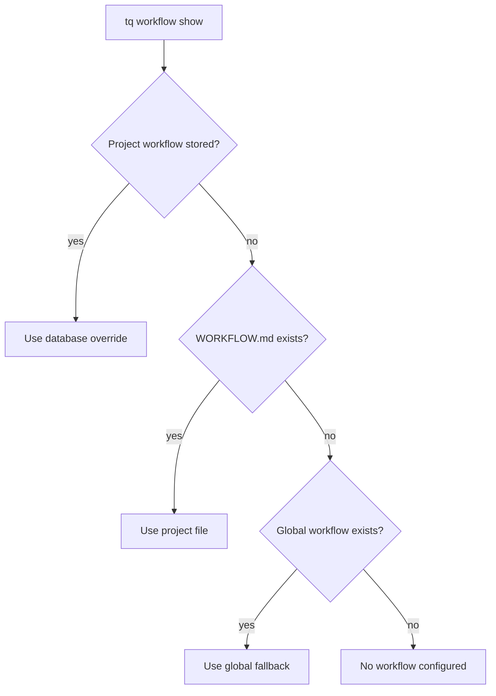

# Workflow Configuration

Tasq は workflow document を使って、project 内で agent がどのように作業すべきかを記述します。workflow は project-local file、保存された project override、または global fallback から解決できます。

## 解決順序



## Project workflow file

workflow を codebase と一緒に移動させたい場合は、repository に `WORKFLOW.md` を置きます。review rule、verification command、task flow が project と一緒に version 管理されるため、local development では最も扱いやすい model です。

## 保存された override

repository を変更せずに machine-local workflow change が必要な project では、保存された override を使います。

```sh
tq workflow add --project tasq --file WORKFLOW.md
tq workflow show --project tasq
tq workflow remove --project tasq
```

保存された workflow を削除すると、project は file-based resolution に戻ります。

## 実践的な指針

workflow document は operational に保ってください。branch policy、required verification、issue synchronization、handoff expectation を定義します。長い design explanation は workflow file に置かず、documentation へ link してください。
