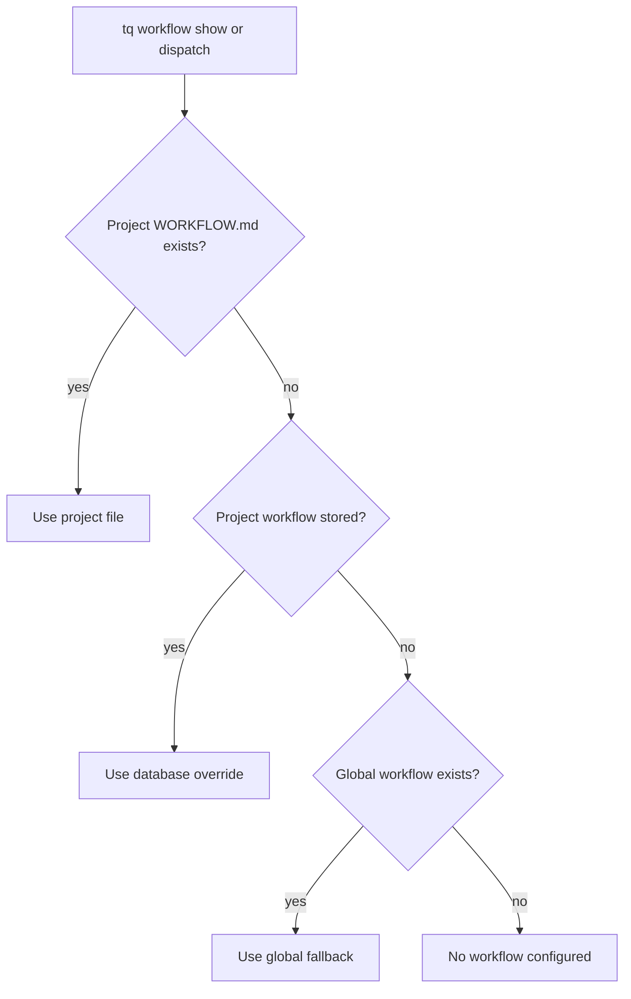

# Workflow Configuration

Tasq はワークフロー文書を使って、エージェントがプロジェクトでどのように作業すべきかを定義します。ワークフローはプロジェクトローカルのファイル、保存済みのプロジェクト override、またはグローバル fallback から取得できます。

## 解決順序



利用可能な最初のソースが選ばれます。`tq workflow show` と orchestrator はどちらも、この順序でプロジェクトの有効なワークフローを解決します。

## プロジェクトのワークフローファイル

ワークフローをコードベースと一緒に管理したい場合は、リポジトリに `WORKFLOW.md` を置いてください。レビュー規則、検証コマンド、作業フローもプロジェクトと一緒にバージョン管理されるため、ローカル開発ではこれが最も簡単な方法です。

## フロントマターとプロンプトテンプレート

`WORKFLOW.md` の先頭には YAML フロントマターを置けます。その後には、エージェント向けの Markdown プロンプトテンプレートを記述します。フロントマターは機械可読なオーケストレーション設定であり、プロンプトテンプレートにはエージェントが読んで従う手順を記述します。

サポートされるフィールド、検証規則、hook の挙動、プロンプトテンプレート変数は、正典である [Tasq Symphony Workflow Contract](https://github.com/version-1/tasq/blob/main/docs/symphony/WORKFLOW_CONTRACT.ja.md) で定義しています。

## ワークフローが読み込まれるタイミング

Tasq は、orchestrator がキューに入った作業を評価し、エージェント実行を準備するときに、プロジェクトごとの有効なワークフローを解決します。そのため、プロジェクトの `WORKFLOW.md` や保存済み override の変更は、その後に割り当てられる作業に反映されます。すでに実行中のエージェント実行には反映されません。

`WORKFLOW.md` を編集したら、課題を `ready` に移動する前に `tq project check <key>` を実行し、プロジェクト設定を検証してください。

## 保存済み override

ローカルの `WORKFLOW.md` がなく、リポジトリを変更せずにマシンローカルなワークフローが必要な場合は、保存済み override を使います。ローカルの `WORKFLOW.md` がある場合は常にそちらが優先されるため、プロジェクトにファイルを残したまま保存済みワークフローで上書きすることはできません。

```sh
tq workflow add --project tasq --file machine-local-workflow.md
tq workflow show --project tasq
tq workflow remove --project tasq
```

保存済みワークフローを削除すると、解決順序における次の利用可能なソースが有効になります。

## 実践的な指針

ワークフロー文書は運用に必要な内容に絞ってください。ブランチ方針、必須の検証、課題の同期、引き継ぎ条件を定義します。長い設計説明はワークフローファイルに書かず、関連ドキュメントへリンクしてください。
