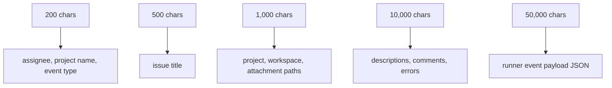

# スキーマ

Tasq は create operation と update operation で、store layer において entity data を validate します。この reference は、client が守るべき public field constraint を要約します。

## Issue tracker entity

| Entity | Required fields | Key constraints |
| --- | --- | --- |
| Issue | `projectId`, `title` | title は 1-500 chars、description は max 10,000 chars、project ownership は immutable |
| Comment | `issueId`, `author`, `body` | body は 1-10,000 chars、type の default は `general` |
| Attachment | `entityType`, `entityId`, `file` | image は PNG/JPEG/GIF/WebP、max 5 MiB |
| Project | `key`, `name`, `location` | key format、name は 1-200 chars、location は absolute |
| ProjectWorkflow | `projectId`, `frontmatter`, `body`, `checksum` | project ごとに workflow override は 1 つ |

## Orchestrator entity

| Entity | Required fields | Key constraints |
| --- | --- | --- |
| Run | `issueId`, `attempt`, `orchestratorId` | run ID は generated、status の default は `queued` |
| RunnerEvent | `runId`, `occurredAt` | payload JSON は存在する場合 valid でなければならない |
| WorkspaceMetadata | `workspaceKey`, `issueId`, `path`, `createdNow` | path は absolute でなければならない |
| WorkspaceSetupFailure | `issueId`, `error` | setup failure context を記録する |

## Enum

| Field | Values |
| --- | --- |
| Issue status | `backlog`, `ready`, `in_progress`, `review`, `done`, `blocked`, `failed` |
| Issue priority | `low`, `normal`, `high`, `urgent` |
| Comment type | `progress`, `blocker`, `handoff`, `general` |
| Attachment entity type | `issue`, `comment` |
| Run status | `queued`, `starting`, `running`, `waiting_for_input`, `succeeded`, `failed`, `cancelled` |

## 文字列とパスの上限

Absolute path field は `/` で始まる必要があります。`tq project add` などの client は、target filesystem に access できる場合に local directory の存在を確認します。
