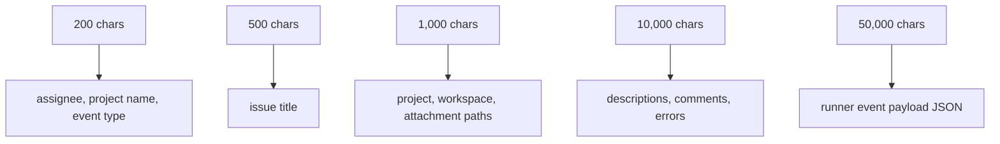

# スキーマリファレンス

Tasq は作成・更新時に、ストア層でエンティティのデータを検証します。このページでは、クライアントが守るべき公開フィールドの制約を要約します。

## Issue Tracker Entities

| Entity | Required fields | Key constraints |
| --- | --- | --- |
| Issue | `projectId`, `title` | title 1-500 chars、description max 10,000 chars、assignee max 200 chars、immutable project ownership |
| Artifact | `type`, `dataType`, `dataValue` | 課題と type の組み合わせごとに 1 件。初期 type の `pull_request` は data type `url`。URL は前後の空白を除去し、絶対 HTTP(S) URL、host 必須、userinfo なし、UTF-8 で最大 4,096 bytes |
| Comment | `issueId`, `author`, `body` | body 1-10,000 chars、type defaults to `general` |
| ChangeRequest | `issueId`, `author`, `body` | 本文は 1〜10,000 文字で、`open` の間だけ編集可能。状態の既定値は `open`。終端状態では変更不可 |
| Attachment | `entityType`, `entityId`, `file` | image PNG/JPEG/GIF/WebP、max 5 MiB |
| Project | `key`, `name`, `location` | key は大文字始まりの legacy 形式（`A-Z`, `0-9`, `_`、1-20 文字）または小文字の kebab-case（1-64 文字）— 正確な正規表現は [design reference](https://github.com/version-1/tasq/blob/main/docs/design/schema.ja.md#project) を参照。name 1-200 chars、description max 10,000 chars、absolute location |
| ProjectWorkflow | `projectId`, `frontmatter`, `body`, `checksum` | one workflow override per project、checksum は SHA256 hex |

## Orchestrator Entities

| Entity | Required fields | Key constraints |
| --- | --- | --- |
| Run | `issueId`, `attempt`, `orchestratorId` | run ID generated、status defaults to `queued` |
| RunnerEvent | `runId`, `occurredAt` | payload JSON must be valid when present |
| WorkspaceMetadata | `workspaceKey`, `issueId`, `path` | workspace key max 200 chars、paths must be absolute |
| WorkspaceSetupFailure | `issueId`, `error` | records setup failure context |

## Enums

| Field | Values |
| --- | --- |
| Issue status | `backlog`, `ready`, `in_progress`, `review`, `done`, `blocked`, `failed`, `cancelled`, `duplicate` |
| Queue status | `backlog`, `pending`, `queued`, `processing`, `completed`, `inactive` |
| Issue priority | `low`, `normal`, `high`, `urgent` |
| Comment type | `progress`, `blocker`, `handoff`, `general` |
| Change request status | `open`, `in_progress`, `resolved`, `canceled` |
| Attachment entity type | `issue`, `comment` |
| Artifact type | `pull_request` |
| Artifact data type | `url` |
| Run status | `queued`, `running`, `succeeded`, `failed`, `cancelled` |

## 文字列とパスの上限

絶対パスのフィールドは `/` で始まる必要があります。`tq project add` などのクライアントは、対象ファイルシステムへアクセスできる場合にローカルディレクトリの存在を確認します。

## 状態遷移

change request は `open` から `in_progress` または `canceled`、`in_progress` から `resolved` または `canceled` へ遷移できます。解決時には orchestrator の実行 ID と、同じ課題に属する結果コメントを記録できます。`resolved` と `canceled` は終端状態です。
